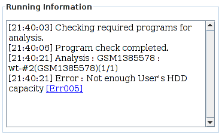
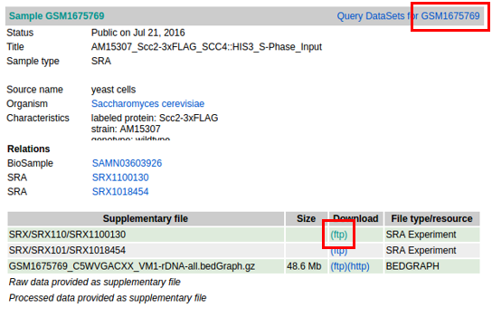
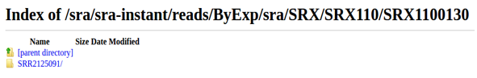
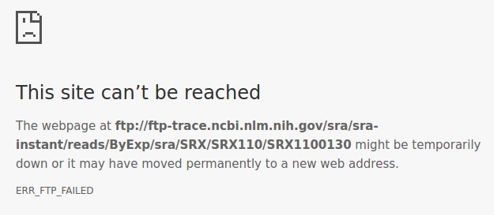
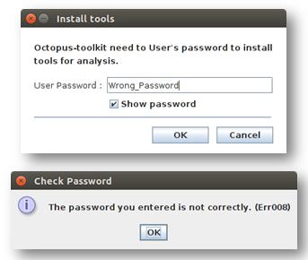

.. _error:

============
7.Error Code
============

7-1.Summary
-----------

.. csv-table::
   :header: "Error ID","Description"
   :widths: 10, 35

    :ref:`Err001<err_001>`,Octopus-toolkit cannot access the web page.
    :ref:`Err002<err_002>`,Incorrect GEO accession number.
    :ref:`Err003<err_003>`,The experiment type cannot be handled with Octopus-toolkit.
    :ref:`Err004<err_004>`,The data cannot be processed.
    :ref:`Err005<err_005>`,Not enough disk space.
    :ref:`Err006<err_006>`,Related to each processing step.
    :ref:`Err007<err_007>`,Some analytics tools are not installed.
    :ref:`Err008<err_008>`,The password you entered does not match.
    :ref:`Err009<err_009>`,Octopus-toolkit can't read/write files from your computer.
    :ref:`Err010<err_010>`,The number of Paired-End data does not match.
	
If you have any questions, Please contact us at Octopustoolkit@gmail.com

7-2.Detail
----------

.. _err_001:

Err001
^^^^^^

Octopus-toolkit attempts to access the NCBI server (`National Center for Biotechnology Information <https://www.ncbi.nlm.nih.gov/>`_) to obtain sample information.

If ``your network connection is unstable``, or ``the NCBI server is tempararily unavailable``, Octopus-toolkit cannot get information for GSE and/or GSM.

First, ``check the network connection`` of your computer. If it is ok, please ``check the`` `NCBI <https://www.ncbi.nlm.nih.gov/>`_ and whether the server is operating normally.

If the above cannot solve the problem, the connection to the NCBI may be ``timed out`` due to unknown reasons. Please re-run the Octopus-toolkit later (``temporary phenomenon``).

.. _err_002:

Err002
^^^^^^

Octopus-toolkit obtains sample information from the GEO (gene expression omnibus) website.

* ``GEO Accession Number`` ::

   A GSExxx is a unique GEO accession number assigned to a study.
   A GSMxxx is a unique GEO accession number assigned to a sample. A single GSE (study) can have a number of GSM (samples).

Octopus-toolkit can only process registered GSE or GSM ids in GEO. ``Err002`` occurs when you put ``unregistered`` accession ids or ``misspelled accession ids``.

* Unregistered GSE id (Input : ``GSE999999``)

.. image:: _static/Error/Err002_Not_Exist.png

* Misspelled or incorrect accession number (Input : ``ChIP-Seq``)

.. image:: _static/Error/Err002_Wrong_Accession_Number.png

Please ``check the GEO accession number`` whether it is registered in the GEO.

.. _err_003:

Err003
^^^^^^

There are many different types of next-generation sequencing (NGS) data. As defined by NCBI (``NGS data`` - `Study type <https://www.ncbi.nlm.nih.gov/geo/summary/?type=series>`_), genome binding/occupancy profiling by high throughput sequencing indicates ChIP-seq data.

Octopus-toolkit currently supports the following types of NGS data. Other NGS types will be skipped.
``expression profiling by high throughput sequencing`` (RNA-seq)
``genome binding/occupancy profiling by high throughput sequencing`` (ChIP-seq / MNase-seq / ATAC-seq / MeDIP-seq / DNase-seq)

(Other NGS types will be added later)

You can check ``experiment type`` of given GEO accession number through the website. (ex: `GSE79452 <https://www.ncbi.nlm.nih.gov/geo/query/acc.cgi?acc=GSE79452>`_)

* Experiment Type

.. image:: _static/Error/Err003_Experiment_Type.png

.. _err_004:

Err004
^^^^^^

Not all data in the GEO can be processed with the Octopus-toolkit. Octopus-toolkit check the following information before processing it.
``Organism``, ``Library strategy``, ``Instrument model``, and ``FTP Address(SRA Experiment)``). (Important)

* DataSet for GSE79452 (Ex : `GSE79452 <https://www.ncbi.nlm.nih.gov/geo/query/acc.cgi?acc=GSE79452>`_) 

.. image:: _static/Error/Err004_GSM_Info.png

``Err004`` is divided into the following four subcategories.

.. csv-table::
    :header: "Sub Error ID","Description"
    :widths: 10, 35

    ``Err004-1``,The organism is not supported.
    ``Err004-2``,The experiment type is not supported (for example Exome-seq).
    ``Err004-3``,The instrument is not supported. Octopus-toolkit can only process data generated by Illumina instrument.
    ``Err004-4``,Raw data (.sra) is currently unavailable (probably newly registered data).

``Err004`` is related to unsupported data by Octopus-toolkit. The following data is currently handled with Octopus-toolkit.

.. list-table::
   :widths: 15 30
   :header-rows: 1

   * - Type
     - Description
   * - Organism
     - Homo sapiens, Mus musculus, Drosophila melanogaster, Saccharomyces cerevisiae, Canis lupus familaris, Arabidopsis thaliana, Danio rerio, Caenorhabditis elegans
   * - Library Strategy
     - ChIP-Seq, RNA-Seq, MeDIP-Seq, ATAC-Seq, DNase-Seq, MNase-Seq
   * - Instrument Model
     - Illumina GA/HiSeq/MiSeq (Illumina)

``Err004-4`` indicates that data has been registered in the GEO, but the raw data (.sra) has not been released yet. Therefore, please check the availability of raw files.

* ``Error004-4`` example : `GSM1675769 <https://www.ncbi.nlm.nih.gov/geo/query/acc.cgi?acc=GSM1675769>`_

.. image:: _static/Error/Err004-4_Example.png

* No raw files (.sra).

.. image:: _static/Error/Err004-4_Not_Exist_Page.png

.. _err_005:

Err005
^^^^^^

This error is related to disk space. To reslove this issue, please make ``enough free space`` and re-run the analysis.

* Check you hard disk space.

.. image:: _static/Error/Err005_File_System_Monitor.png

* Status window.

.. _err_006:

Err006
^^^^^^

``Err006`` is divided into six subcategories.

.. csv-table::
    :header: "Sub Error ID","Description"
    :widths: 10, 40

    :ref:`Err006-1<err_006-1>`,Cannot ``access`` NCBI's FTP server.
    :ref:`Err006-2<err_006-2>`,File converting error from .sra to .fastq using ``fastq-dump``.
    :ref:`Err006-3<err_006-3>`,Related to the .fastq file while checking the quality using ``FastQC``. 
    :ref:`Err006-4<err_006-4>`,No input file (.fastq) for ``Trimming``.
    :ref:`Err006-5<err_006-5>`,Related to the ``Mapping`` step.
    :ref:`Err006-6<err_006-6>`,Related to the ``Sorting`` step (BAM file).

.. _err_006-1:

Err006-1	
________

NCBI provides raw data of published sample through ``FTP server`` to user. If the NCBI homepage is working normally, you can extract the sample information, but if the FTP server does not work, you will not be able to download the data.

To solve this issue, you connects directly to the FTP server of NCBI.

* ``Error006-1`` example : `GSM1675769 <https://www.ncbi.nlm.nih.gov/geo/query/acc.cgi?acc=GSM1675769>`_

If you can connect to the FTP server, download the manually published sample.

* NCBI Ftp server is running.(``Success``)

But the server is closed or samples are not downloaded, please contact the NCBI because it is an issue for the NCBI.

* NCBI Ftp server is closed.(``Fail``)

If the above method works normally, please try Octopus-toolkit again.

If you have an ``Err006-1`` despite retrying, please contact us at the address below.

Contact us : Octopustoolkit@gmail.com

.. _err_006-2:

Err006-2
________

Raw data of samples downloaded from NCBI is compressed in ``SRA format``. For NGS analysis, ``SRA`` file should be converted to ``Fastq`` format. The tool used in this step is ``Fastq-dump``, a sub tool of ``SRA-Toolkit``.

* ``Input file`` : Sequence Read Archive (Extension : ``sra``)
* ``Output file`` : Short read sequence. (Extension : ``fastq``)

``006-2`` occurs when there not exist SRA file, which is an input file for executing Fastq-dump, or when it is an invalid SRA file.

Downloading raw data from the previous step may be caused by disconnecting from FTP server, or raw data uploaded to NCBI may be broken.

You should check your ``network status``, ``free space`` on your computer and try the analysis again.

If the above method does not work, please contact us at the address below.

Contact us : Octopustoolkit@gmail.com

.. _err_006-3:

Err006-3
________

``Err006-3`` means that the input file(``Fastq``) for the ``Quality Check`` is invalid or the issue in the system part during ``Quality Check`` using ``FastQC``.

You should check fastq files on your computer and try the analysis again.

If the above method does not work, please contact us at the address below.

Contact us : Octopustoolkit@gmail.com

After successfully completing the ``Quality Check`` step, some problems prevent ``FastQC`` from generating ``Fastqc_data.txt``.

Octopus-toolkit extracts the encoding information of the sample from ``fastqc_data.txt`` among the outputs of ``FastQC``. Therefore, if ``Fastqc_data.txt`` is not generated, it stores the encoding information of the latest samples. (``Sanger / Illumina 1.9``)

* ``Err006-3`` Encoding information:

.. image:: _static/Error/Err006-3_Encoding.png

.. _err_006-4:

Err006-4
________

``Err006-4`` occurs when there is no input file(``Fastq``) for ``Trimming`` step or when all reads are removed due to ``bad quality``.

You should check fastq files on your computer and try the analysis again.

If the above method does not work, please contact us at the address below.

Contact us : Octopustoolkit@gmail.com

If all reads are removed by ``bad quality``, Octopus-toolkit will use the non-trimmed input file(``Fastq``) to proceed. (Next step : ``Mapping``)

.. _err_006-5:

Err006-5
________

``Err006-5`` is related to the following causes.

* The input file (``non_trimmed Fastq``, ``Trimmed Fastq``) does not exist.
* A large number of reads are trimmed due to ``bad sequencing quality`` or ``high threshold used``.
* Too few mapped reads (Less than 2 MegaByte).

You should check input file (``non-trimmed and trimmed fastq files``), ``read count``, ``file size after timming``.

.. _err_006-6:

Err006-6
________

``Err006-6``: BAM (mapped) file does not exist or the number of mapped reads is too small.

You should check ``input file`` and ``BAM file``.

.. _err_007:

Err007
^^^^^^

``Err007`` is related to the installation step.

To use the Octopus-toolkit, your must follow the installation procedure completely: ``Requirement(Err007-1)`` and ``analysis tools(Err007-2)``.

* :ref:`Requirement <requirement>` : Library files must be installed.
* Analysis tools : Tools that are installed automatically by Octopus-toolkit. If the installation procedure was interuppted, please remove the Octopus-toolkit directory and rerun it.

Octopus-toolkit download files from the ``HOMER`` website. If the website (http://homer.ucsd.edu/homer/) is unavailable, ``Err007`` can occur.

.. _err_008:

Err008
^^^^^^

``Err008`` is related to password issue.

* ``Password`` : You must enter your password once during the installtion step.

Please check your password and try again.

* When you enter incorrect password (Example : My password = ktm123)

.. _err_009:

Err009
^^^^^^

``Err009`` is related to script files generated by Octopus-toolkit. If this happens, please rerun it later.

.. _err_010:

Err010
^^^^^^

``Err010`` indicates that the number of files (paired-end sample) does not match when merging.

If there are several SRA files in one sample (GSM), Octopus-toolkit will merge them.

Paired-end data must have two files, Sample1_1.fastq and Sample1_2.fastq.

If if fails, this error occurs.

