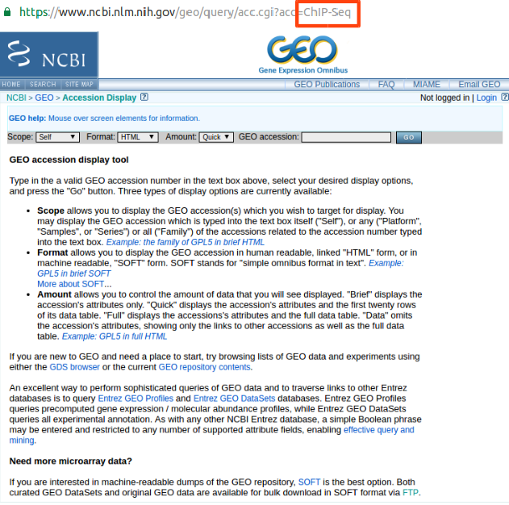
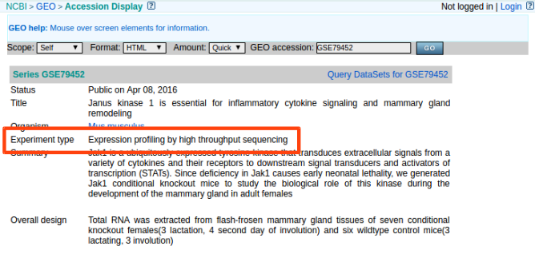
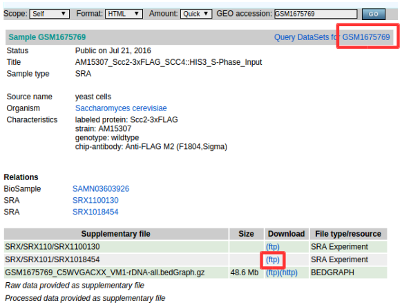
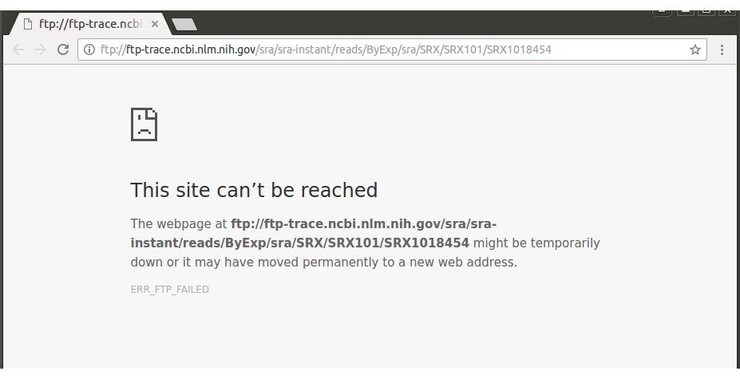
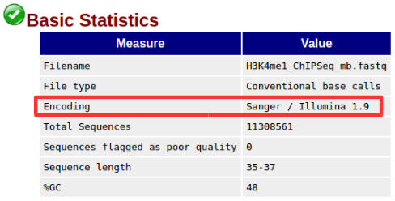

.. _error:

==========
Error Code
==========

Summary
-------

.. csv-table::
   :header: "Error ID","Description"
   :widths: 10, 35

    :ref:`Err001<err_001>`,Octopus-toolkit can't access web page.
    :ref:`Err002<err_002>`,This GEO accession number is not exist.
    :ref:`Err003<err_003>`,Experiment type not supported by Octopus-toolkit.
    :ref:`Err004<err_004>`,Dataset not supported by Octopus-toolkit.
    :ref:`Err005<err_005>`,Your Hard Disk(HDD) space is not enough for analysis.
    :ref:`Err006<err_006>`,This Error occurred during the analysis process.
    :ref:`Err007<err_007>`,Some analytics tools are not installed.
    :ref:`Err008<err_008>`,The password you entered does not match.

Detail
------

.. _err_001:

Err001
^^^^^^

Octopus-toolkit connects to NCBI (`National Center for Biotechnology Information <https://www.ncbi.nlm.nih.gov/>`_) to obtain the sample information.

If ``the network of your computer is not connected``, or ``the server of the NCBI is closed``, you will not get the sample information

First, ``check the network connection status`` of your computer. If there is no problem with the network connection, ``connect to the`` `NCBI <https://www.ncbi.nlm.nih.gov/>`_ and check that the server is operating normally.

If both of the above statuses are normal, the connection to the NCBI has been ``timed out`` to obtain the sample information. It is ``temporary phenomenon``, so try again later.

If you have an error related to ``Err001``, Please contact us at the address below.

Contact us : Octopustoolkit@gmail.com

.. _err_002:

Err002
^^^^^^

Octopus-toolkit obtains sample information through the GEO (Gene Expression Omnibus) accession number entered.

* ``GEO Accession Number`` ::

   GSExxx : Each Series(Study) record is assigned a unique and stable GEO accession number.
   GSMxxx : Each Sample record is assigned a unique and stable GEO accession number.

You can only use the accession number registered in GEO, and ``Err002`` error occurs when entering accession number of ``unregistered`` or ``wrong format``.

* Not exist GEO accession number (Input : ``GSE999999``)

.. image:: _static/Error/Err002_Not_Exist.png

* Wrong GEO accession number format (Input : ``ChIP-Seq``)

Please ``check again`` if GEO has the accession number of the sample registered.
If you have an error related to ``Err002``, Please contact us at the address below.

Contact us : Octopustoolkit@gmail.com

.. _err_003:

Err003
^^^^^^

NCBI offers a variety of study types such as expression profiling by array(``Array data``) and genome binding/occupancy profiling by high throughput sequencing(``NGS data``). (`Study type <https://www.ncbi.nlm.nih.gov/geo/summary/?type=series>`_)

Octopus-toolkit supports analysis of both ``expression profiling by high throughput sequencing`` and ``genome binding/occupancy profiling by high throughput sequencing`` in NGS data.

(Other NGS study types will be added later.)

You check the ``experiment type`` of the GEO accession number you entered. ``GSE`` number except GSM is available. You access the GSE accession number you entered the page. (Ex : `GSE79452 <https://www.ncbi.nlm.nih.gov/geo/query/acc.cgi?acc=GSE79452>`_)

* Experiment Type

GSE number including multiple types must include either expression profiling by high throughput sequencing or genome binding/occupancy profiling by high throughput sequencing.

If you have an error related to ``Err003``, Please contact us at the address below.

Contact us : Octopustoolkit@gmail.com

.. _err_004:

Err004
^^^^^^

When uploading raw data of sample to NCBI, various information about sample data is registered together. The dataset for GSM number provides useful information for users to use published data.

Among this information, Octopus-toolkit refers the ``Organism``, ``Library strategy``, ``Instrument model``, ``FTP Address(SRA Experiment)``). (Important)

* DataSet for GSM accession number (Ex : `GSE79452 <https://www.ncbi.nlm.nih.gov/geo/query/acc.cgi?acc=GSE79452>`_) 

.. image:: _static/Error/Err004_GSM_Info.png

``Err004`` errors are divided into 4 details below. 

.. csv-table::
    :header: "Sub Error ID","Description"
    :widths: 10, 35

    ``Err004-1``,Can not supported Organism
    ``Err004-2``,Can not supported Library Strategy. (NGS-Seq)
    ``Err004-3``,Can not supported Instrument Model. (ILLUMINA)
    ``Err004-4``,Not exist FTP address of raw data. (SRA format)

``Err004`` displays errors for unsupported data by Octopus-toolkit. The data supported by Octopus-toolkit from ``Err004-1`` to ``Err004-3`` is shown below.

.. list-table::
   :widths: 15 30
   :header-rows: 1

   * - DataSet
     - Description
   * - Organism
     - Homo sapiens, Mus musculus, Drosophila melanogaster, Saccharomyces cerevisiae, Canis lupus familaris
   * - Library Strategy
     - ChIP-Seq, RNA-Seq, MeDIP-Seq, ATAC-Seq, Dnase-Seq, Mnase-Seq
   * - Instrument Model
     - Illumina Hiseq (Data generated by Illumina)

``Err004-4`` error mean that information about the sample has uploaded, but the raw data is not uploaded to GEO, Please contact uploader of the sample to resolve this issue.

* ``Error004-4`` example : `GSM1675769 <https://www.ncbi.nlm.nih.gov/geo/query/acc.cgi?acc=GSM1675769>`_

* Not exist FTP Address of raw data (SRA format)

Please check again the information that Octopus-toolkit supports.
If you have an error related to ``Err004``, Please contact us at the address below.

Contact us : Octopustoolkit@gmail.com

.. _err_005:

Err005
^^^^^^

NGS analysis allows users to get a lot of information and data about the parts of interest. 

The data generated in the NGS analysis process has capacity over KiloByte to GigaByte, and your computer needs a lot of ``free space`` to store it.

To solve this issue, if the capacity of data to be analyzed is large or the number of samples is large, Please ``prepare enough free space and analyze again``.

If you have an error related to ``Err005`` or have any question, Please contact us at the address below.

Contact us : Octopustoolkit@gmail.com

.. _err_006:

Err006
^^^^^^

``Err006`` errors are divided into 6 details

.. csv-table::
    :header: "Sub Error ID","Description"
    :widths: 10, 40

    :ref:`Err006-1<err_006-1>`,Can not ``access`` NCBI's FTP server.
    :ref:`Err006-2<err_006-2>`,Incorrect input file(``SRA``) or Fastq-dump error used to ``convert`` the raw file.
    :ref:`Err006-3<err_006-3>`,Incorrect input file(``Fastq``) or Error occurred during ``Quality Check``
    :ref:`Err006-4<err_006-4>`,Incorrect input file(``Fastq``) or Error occurred during ``Trimming``.
    :ref:`Err006-5<err_006-5>`,The number of mapped reads is small or an error occurred during ``Mapping``.
    :ref:`Err006-6<err_006-6>`,An error occurred during ``Sorting``.

.. _err_006-1:

Err006-1	
________

NCBI provides raw data of published sample through ``FTP server`` to user. If the NCBI homepage is working normally, you can extract the sample information, but if the FTP server does not work, you will not be able to download the data.

To solve this issue, you connects directly to the FTP server of NCBI.

If you can connect to the FTP server, download the manually published sample.

But the server is closed or samples are not downloaded, please contact the NCBI because it is an issue for the NCBI.

If the above method works normally, please try Octopus-toolkit again.

If you have an ``Err006-1`` despite retrying, please contact us at the address below.

Contact us : Octopustoolkit@gmail.com

.. _err_006-2:

Err006-2
________

Raw data of samples downloaded from NCBI is compressed in ``SRA format``. For NGS analysis, ``SRA`` file should be converted to ``Fastq`` format. The tool used in this step is ``Fastq-dump``, a sub tool of ``SRA-Toolkit``.

* ``Input file`` : Sequence Read Archive (Extension : ``sra``)
* ``Output file`` : Short read sequence. (Extension : ``fastq``)

``006-2`` occurs when there not exist SRA file, which is an input file for executing Fastq-dump, or when it is an invalid SRA file.

Downloading raw data from the previous step may be caused by disconnecting from FTP server, or raw data uploaded to NCBI may be broken.

You should check your ``network status``, ``free space`` on your computer and try the analysis again.

If the above method does not work, please contact us at the address below.

Contact us : Octopustoolkit@gmail.com

.. _err_006-3:

Err006-3
________

``Err006-3`` means that the input file(``Fastq``) for the ``Quality Check`` is invalid or the issue in the system part during ``Quality Check`` using ``FastQC``.

You should check fastq files on your computer and try the analysis again.

If the above method does not work, please contact us at the address below.

Contact us : Octopustoolkit@gmail.com

After successfully completing the ``Quality Check`` step, some problems prevent ``FastQC`` from generating ``Fastqc_data.txt``.

Octopus-toolkit extracts the encoding information of the sample from ``fastqc_data.txt`` among the outputs of ``FastQC``. Therefore, if ``Fastqc_data.txt`` is not generated, it stores the encoding information of the latest samples. (``Sanger / Illumina 1.9``)

* ``Err006-3`` Encoding information:

.. _err_006-4:

Err006-4
________

``Err006-4`` occurs when there is no input file(``Fastq``) for ``Trimming`` step or when all reads are removed due to ``bad quality``.

You should check fastq files on your computer and try the analysis again.

If the above method does not work, please contact us at the address below.

Contact us : Octopustoolkit@gmail.com

If all reads are removed by ``bad quality``, Octopus-toolkit will use the non-trimmed input file(``Fastq``) to proceed. (Next step : ``Mapping``)

.. _err_006-5:

Err006-5
________

``Err006-5`` is caused by the following causes.

* The input file (``non_trimmed Fastq``, ``Trimmed Fastq``) does not exist.
* A large number of reads are trimmed. (``Bad quality``, ``High threshold`` of quality)
* The number of mapped reads is too small. (Less than 2 MegaByte)
* Select a ``genome`` that does not match the sample.

You should check input file (``non-trimmed, trimmed fastq``), ``Read count``, ``file capacity`` for mapping and try the analysis again.

If the above method does not work, please contact us at the address below.

Contact us : Octopustoolkit@gmail.com

.. _err_006-6:

Err006-6
________

``Err006-6`` means the input file (Bam, mapped fastq) does not exist, or the number of mapped reads is too small.

You should check ``input file``, ``mapped reads count`` and try the analysis again.

If the above method does not work, please contact us at the address below.

Contact us : Octopustoolkit@gmail.com

.. _err_007:

Err007
^^^^^^

``Err007`` indicates that the ``requirements`` and ``analysis tools`` required to use Octopus-toolkit are not installed on your computer.

To use the Octopus-toolkit, your computer must complete installing both ``Requirement(Err007-1)`` and ``analysis tools(Err007-2)``.

* :ref:`Requirement <requirement>` : The library that you need to install yourself before run Octopus-toolkit.(By User)
* Analysis tools : Tools installed automatically by Octopus-toolkit after run Octopus-toolkit.(By Program)

``Homer`` may be in the list when you run Octopus-toolkit after the installation is completed normally. Unlike other tools, Homer loads some files from the Homer's homepage for installation. Therefore, if Homer's homepage does not work properly, it may not be installed.

Although the Homer's homepage works normally Homer is on the list, please contact us at the address below.

If the analysis tool's name is listed in the list after the analysis tool is installed automatically or Octopus-toolkit not works, please contact us at the address below.

Contact us : Octopustoolkit@gmail.com

.. _err_008:

Err008
^^^^^^

``Err008`` indicates that the password entered by you is not match.

* ``Password`` : This is the password used to log in to your computer.

Please check your password again and try again.

If you have an error related to ``Err008`` or have any question, Please contact us at the address below.

Contact us : Octopustoolkit@gmail.com

