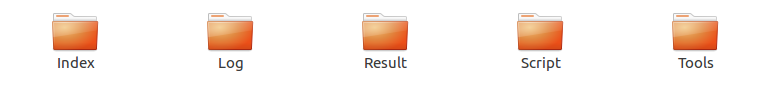
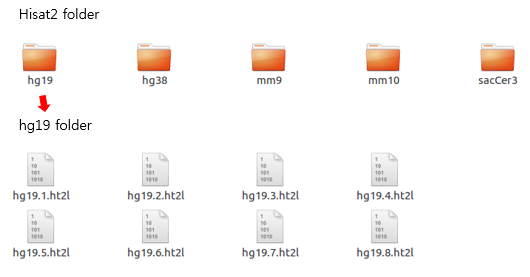
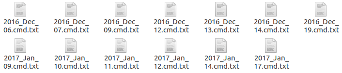
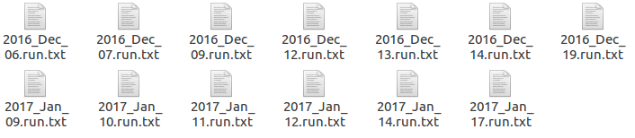
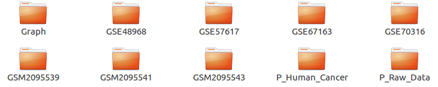
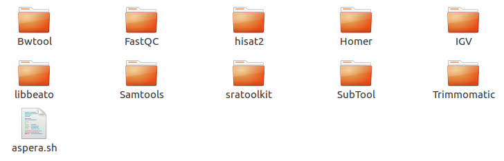

========================
3.Octopus-toolkit folder
========================

Octopus-toolkit creates 5 main folders when you run the program.

* Octopus-toolkit main folder.

.. list-table::
   :widths: 10 10 30
   :header-rows: 1

   * - Main Folder
     - Sub Folder
     - Description
   * - ``Index``
     - Reference, Hisat2
     - Reference data for analysis and Hisat2 indexing file for alignment are stored.
   * - ``Log``
     - Command, Run
     - The used command for analysis and the log of the running information are stored.
   * - ``Result``
     - GSE_Folder, P_Folder, G
     - The result files analyzed by user are stored.
   * - ``Script``
     - 
     - Create and save the required script file during analysis.
   * - ``Tools``
     - analysis tools
     - Save the 3rd party tools used by Octopus-toolkit for analysis.

3-1.Index-Reference
^^^^^^^^^^^^^^^^^^^

* ``Reference folder``

.. image:: _static/Folder/2.Reference_folder.png

The reference folder contains various information about the genome for analysis.

Before starting each process, Octopus-toolkit inspects the data of the genome needed for analysis and automatically installs the insufficient data.

3-2.Index-Hisat2
^^^^^^^^^^^^^^^^

The reference genome should be indexed at least once before proceeding with the alignment. The Hisat2 folder contains data indexed the reference genome using the Hisat2 tool.

Octopus-toolkit inspects the index file of the genome before running the alignment and runs the indexing process if it does not exist.

3-3.Log-Command
^^^^^^^^^^^^^^^

* ``Command folder``

The Command folder contains files that stored the commands used in Octopus-toolkit during analysis. 

The file name is created based on the date when the analysis started. (:download:`2016_Dec_06.cmd.txt<_templates/2016_Dec_06.cmd.txt>`)

3-4.Log-Run
^^^^^^^^^^^

* ``Run folder``

The Run folder contains files that stored running information recorded in the Octopus-toolkit during analysis.

The file name is created based on the date when the analysis started. (:download:`2016_Dec_06.run.txt<_templates/2016_Dec_06.run.txt>`)

3-5.Result
^^^^^^^^^^

* ``Result folder``

The Result folder stores the output of all processes analyzed using Octopus-toolkit.

The analyzed result folder name using the public data is GEO accession number you entered. Conversely, the result folder name of Private data begins with `P_.`

The Graph folder stores the drawn Heatmap and Lineplot using the Graph function. 

The output of processes in the Result folder is : :ref:`Output Link<output>`

3-6.Script
^^^^^^^^^^

* ``Script folder``

.. image:: _static/Folder/7.Script_folder.png

The Script folder stores the script file for analyzing NGS data in Octopus-toolkit.

3-7.Tools
^^^^^^^^^

* ``Tools folder``

The Tools is the folder where the 3rd party tools are installed to analyze NGS data.

Octopus-toolkit inspects in this folder whether or not the analysis tool is installed.

