============
5.User Guide
============

Octoput-toolkit can analyze a number of publicly available next-generation sequencing (NGS) data in with a single step.
In addition, you can also analyze your own data (.fastq) using the same analysis pipeline that is provided by the Octopus-toolkit.

* ``Supported NGS types`` : RNA-seq, ChIP-seq, ATAC-seq, DNase-seq, MeDIP-seq, and MNase-seq
* ``Public data`` : NGS data released from gene expression omnibus (GEO).
* ``Private data`` : NGS data stored in your computer (.fastq or .fastq.gz)

Octopus-toolkit provides several additional functions for further analysis.
* ``Peak Calling`` : Identification of read enriched regions (.bed)
* ``Drawing Graph`` : Drawing line plot and heatmap on specified regions (.bed)
* ``Visualization`` : Explore genome with bigWig files through IGV

Basically, Octopus-toolkit processes NGS data by the following steps.

* ``NGS data processing``

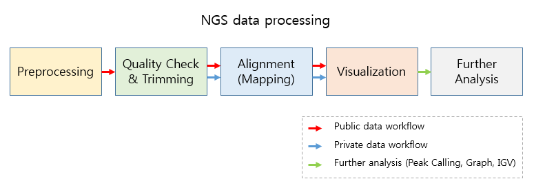

.. _3rd_party_tool:

5-1.3rd party tools used in Octopus-toolkit
^^^^^^^^^^^^^^^^^^^^^^^^^^^^^^^^^^^^^^^^^^^

Octopus-toolkit utilizes the following 3rd party tools during the process.

.. list-table::
   :widths: 10 10 10 10
   :header-rows: 1

   * - NGS Process
     - Function
     - 3rd party tool
     - Sub-tools
   * - ``Preprocessing``
     - Download SRA files from NCBI
     - ``Aspera``
     - ascp
   * - 
     - Convert SRA files to Fastq files
     - ``SRAToolkit``
     - fastq-dump
   * - ``Quality check``
     - Quality check for raw data
     - ``FastQC``
     - fastqc
   * - ``Trimming``
     - Trimming for adapter sequence and portions of low-quality reads
     - ``Trimmomatic``
     - 
   * - ``Alignment``
     - Indexing a reference genome
     - ``Hisat2``, ``STAR``
     - hisat2-build, STAR
   * - 
     - Mapping reads to the reference genome
     - ``Hisat2``, ``STAR``
     - hisat2-align, STAR
   * - ``Visualization``
     - Create bigWig files for visualization
     - ``Homer``
     - makeTagDirectory,makeUCSCFile,analyzeRepeats
   * - ``Peak calling``
     - Detect enriched regions by mapped reads
     - ``Homer``
     - findPeak, pos2bed,annotatePeaks
   * - ``Graph``
     - Calculate normalized values from bigWig files
     - ``Bwtool``
     - matrix
   * - 
     - Draw the heatmap and line plot
     - ``R``
     - pheatmap, ggplot2
   * - ``IGV``
     - Explore the genome with processed data (bigWig files)
     - ``IGV``
     -


5-2.Public data
^^^^^^^^^^^^^^^

Quick Start
___________

.. note::
    1. Enter a GEO (Gene Expression Omnibus) accession number or click the open button to load a list of GEO accession numbers.
    2. Click the Run button.
    3. Select appropriate options you want to use.
    4. Click the Run button to begin the analysis.

Work flow
_________

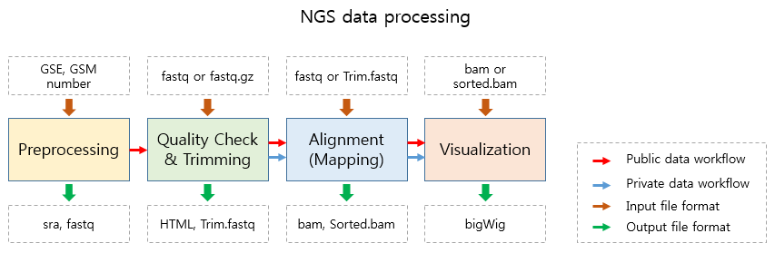

To analyze a single or a set of publicly available NGS data from GEO.
_____________________________________________________________________

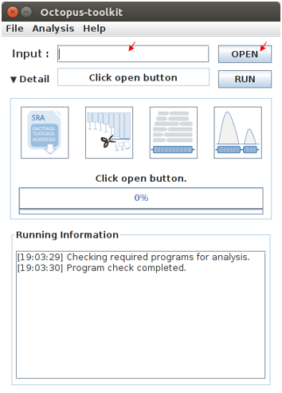

Please enter a single GEO Accession number or open a text file containing GEO Accession numbers.

* Input : ``GEO Accession number`` ::

   GSExxx : Each GSE (study) record is assigned to a single study which contains at least a NGS data (GSM).
   GSMxxx : Each GSM (sample) record is assigned to a single NGS data.

* Input : ``GEO Accession number list`` (:download:`example.list<_templates/GEO_Accession_number.list>`)


1. Enter a single GEO accession number or click the open button to load a list GEO accession numbers.

2. Click the Run button.

.. _octopus_option:

Octopus option
______________

You can change a number of parameters provided by Octopus-toolkit or the integrated tools.

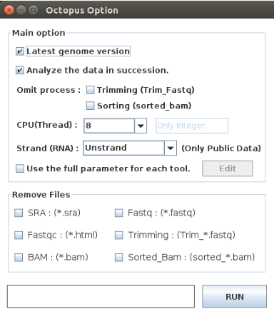

.. csv-table::
   :header: "Option","Decription"
   :widths: 10,35

   ``Latest genome version``, Use the latest genome rather than the genome used for the study.
   ``Skip the completed samples``, Skip the samples that have already been analyzed.
   ``Omit process``,Omit the selected processes such as trimming and sorting steps.
   ``CPU(Thread)``,Set the number of CPUs to use.
   ``Adjust all parameters for each step``,Change full parameters in each step.
   ``Edit``,Open the Full parameter option window.
   ``Strand (RNA)``,Set the library strand for RNA-Seq.
   ``Alignment tool for RNA-seq``,Set the alignment tool for RNA-seq.
   ``Fastq -> Fastq.gz``,Compress Fastq to Fastq.gz.
   ``Bam -> CRAM``, Compress Bam to CRAM.
   ``Remove Files``,Delete selected intermediate files once each process is completed to save space.

* ``Latest genome version``

Octopus-toolkit can analyze the genomes of Homo sapiens, Mus musculus, Drosophila melanogaster, Saccharomyces cerevisiae, and Canis lupus familaris.

.. list-table:: Available analysis genome version
   :widths: 10 10
   :header-rows: 1

   * - Organism
     - Genome version
   * - Homo sapiens
     - hg38, hg19, hg18
   * - Mus musculus
     - mm10, mm9
   * - Drosophila melanogaster
     - dm6, dm3
   * - Saccharomyces cerevisiae
     - sacCer3
   * - Canis lupus familaris
     - canFam3
   * - Arabidopsis thaliana
     - tair10
   * - Danio rerio
     - danRer10
   * - Caenorhabditis elegans
     - ce11

The latest genome version uses the latest version of the genome for analysis. If you don't select this option, Octopus-toolkit uses the genome defined by submitter.

 * Latest genome (O) : hg38, mm10, dm6, sacCer3, canFam3, tair10, danRer10, ce11
 * Latest genome (X) : hg19, mm9, dm3, sacCer3, canFam3, tair10, danRer10, ce11

* ``Skip the completed samples``

While analyzing a number of GSE/GSM data, you can stop the analysis and resume it later.

Octoput-toolkit will skip the samples that have been analyzed completely.

If you have the samples that have been analyzed completely and you want to analyze it again, please do not check this option.

* ``Omit process``

The omit process allows you to skip the trimming step and/or the sorting step. This shortens the anaysis time.

During the trimming process, all reads will be discarded if all of the reads have bad sequencing quality. Octopus-toolkit will analyze the original raw data (.fastq) in this case by skipping the trimming step.

During the sorting process, BAM file will be sorted by using Samtools. In general, many applications uses sorted BAM files. If you are not interested in analyzing the sorted BAM files, you may skip this process.

* ``CPU(Thread)``

You can set the number of CPUs for analysis. (Default : Maximum number of cores depending on your computer)

* ``Adjust all parameters for each step``

You can adjust many parameters for each stop. Check the box and click the Edit button. The parameter window will pop up.

Please refer to the link for details : :ref:`Full Parameter<full_parameter>`

* ``Edit``

When you click the Edit button, the parameter window will appear.

* ``Strand (RNA)``

The strand option allows you to choose whether or not to take the stranded information into account. This is only available for stranded-specific RNA-seq.

Octopus-toolkit extracts information from the GEO website when analyzing the public data. However, stranded-specific information of RNA-seq is not well documented. Therefore, this may or may not be applicable depending on the data.

You can select either non-strand library or the strand-specific library such as FR-Firststrand, FR-Secondstrand using this option.

* ``RNA-Seq alignment tools``

You can select an alignment tool to be used during the alignment process for RNA-seq: HISAT2 or STAR.

HISAT2 uses less memory (RAM) than STAR, but STAR is generally faster than HISAT2.

* ``Fastq->Fastq.gz`` or ``Bam->CRAM``

You can compress intermediate files to save your disk space.

* ``Remove Files``

Each step creates intermediate files which may or may not be used. If you want to further analyze the processed data, you might want to keep those intermediate files.
If not, you can remove intermediate files (up to few hundread gigabytes) by selecting the boxes in Reomve Files window. 

.. list-table::
   :widths: 10 10 10
   :header-rows: 1

   * - Option
     - Extension
     - Description
   * - ``SRA``
     - sra
     - Compressed raw data downloaded from NCBI. (Sequence Read Archive)
   * - ``Fastq``
     - fastq or fq
     - Raw data converted during preprocessing. (A short read sequence file)
   * - ``Fastqc``
     - html or text
     - Output generated during Quality Check. (output of FastQC)
   * - ``Trimming``
     - fastq or fq
     - Output generated during Trimming. (Trimmed raw file(Fastq))
   * - ``BAM``
     - bam
     - Output generated during Alignment. (Mapped read to the genome)
   * - ``Sorted_Bam``
     - bam
     - Output generated during Sorting. (Sorted mapped read)

3. Set the paramters and options.

4. Click the Run button to begin the anlaysis.


Run
___


* Below shows progress bar and status window (GSM1385578).

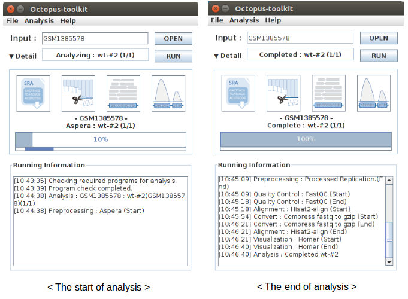


5-3.Private data
^^^^^^^^^^^^^^^^

Quick Start
___________

.. note::
    1. Select the analysis tab -> Select the Private Data function in the Menu bar.
    2. Select raw files (.fastq) in your computer.
    3. Add appropriate information for each sample in the private table.
    4. Click the Run button in the private table.

Analyzing your data (private data)
__________________________________

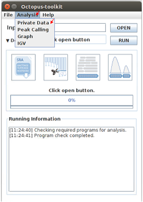

Unlike the public data analysis, private data analysis does not require the converting step (.sra to .fastq).

Input files can be fastq (.fastq or .fq) files or compressed fastq (.fastq.gz or .fq.gz) files.

Files must follow the rules below.

.. note::
    * Raw data : Sample ``.fastq`` or Sample ``.fq``
    * compressed Raw data : Sample ``.fastq.gz`` or Sample ``.fq.gz``
    * Single-End data : Sample ``.fastq`` (or fq, fastq.gz, fq.gz)
    * Paired-End data : Sample ``_1.fastq``, Sample ``_2.fastq``

Octopus-toolkit only loads files that match the above rules.

Private table
_____________

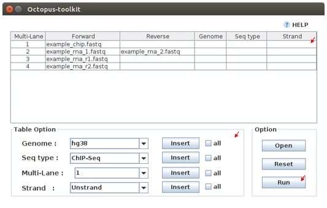

Octopus-toolkit requires appropriate sample information for each file. You need to specify the required information.

If any of the selected files does not appear in the list, please check the file name and format of your files.

You must specify the following information for each sample.

.. csv-table::
   :header: "Option","Decription"
   :widths: 10,20

   ``Genome``,Select the genome.
   ``Seq type``,Select the experimental type such as ChIP-seq.
   ``Multi-Lane``,Set the Multi-lane option.
   ``Strand``,Select the strand strategy if applicable.

* ``Genome``

The following genomes are available in the Octopus-toolkit:

.. list-table::
   :widths: 8 10
   :header-rows: 1

   * - Species
     - Genome version
   * - ``Homo sapiens``
     - ``hg38`` (Dec.2013, GRCh38), ``hg19`` (Feb.2009,GRCh37), ``hg18`` (Mar.2006 NCBI36)
   * - ``Mus musculus``
     - ``mm10`` (Dec.2011 GRCm38), ``mm9`` (July.2007 NCBI37)
   * - ``Drosophila melanogaster``
     - ``dm6`` (Aug.2014 BDGP Release 6+ ISO1 MT), ``dm3`` (Apr.2006 BDGP R5)
   * - ``Saccharomyces cerevisiae``
     - ``sacCer3`` (Apr.2011 SacCer_Apr2011)
   * - ``Canis lupus familaris``
     - ``canFam3`` (Sep.2011 Broad CanFam3.1)
   * - ``Arabidopsis thaliana``
     - ``tair10`` 
   * - ``Danio rerio``
     - ``danRer10`` (Sep.2014 GRCz10)
   * - ``Caenorhabditis elegans``
     - ``ce11`` (Feb.2013 WBcel235)


.. _seq_type:

* ``Seq type``

Octopus-toolkit supports the following experimenatal types: 
ChIP-Seq, RNA-Seq, MeDIP-Seq, ATAC-Seq, DNase-Seq and MNase-Seq.

* ``Multi-Lane``

A single sample can be obtained from muliple lanes in a sequencing instrument. In this case, files from multe lanes can be merged by setting the same number in the Multi-Lane column.

Multi-lane files generally have the following filenames. ::

    Sample.L001.fastq, Sample.L002.fastq, Sample.L003.fastq ... Sample.L008.fastq

To merge the above files, you must set the number of ‘Multi-Lane columns’ to the same number for each file.

* ``Strand``

This option is to set the library strategy for RNA-seq.

1. Unstranded library : ``Unstrand`` (Default)
2. Strand-specific library : ``FR-Firststrand`` or ``FR-secondstrand``


Options
______________

Options for private analysis is the same as public data analysis. Please refer to the public data analysis. (:ref:`Octopus option<octopus_option>`)

Run
___

* Snapshots (Private data analysis)

.. image:: _static/Guide/6.Octopus-toolkit_run_private.png

5-4.Peak Calling
^^^^^^^^^^^^^^^^

Quick Start
___________

.. note::
    1. Select the Analysis tab -> Click the Peak Calling function in the Menu bar.
    2. Select the output folder (Result/GSExxxxx) in the Result directory generated by Octopus-toolkit.
    3. Add information of each sample in the peak calling table.
    4. Click the Run button.
    
Peak calling anlaysis
____________________________

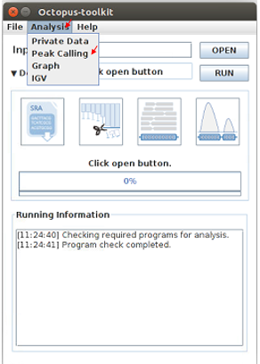

The purpose of the peak calling anlaysis is to identify regions enriched by mapped reads.

In order to perform the peak calling analysis, you must have the Octopus-toolkit output folders.

1. Select the Analysis tab -> Click the Peak Calling function in the Menu bar.
2. Select output directories generated by the Octopus-toolkit.

Peak calling table
__________________

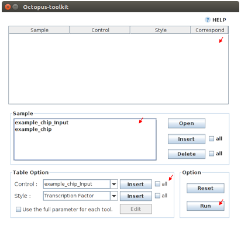

To run the peak calling analysis, please select output folders (Result/GSExxxxx). Then, fill in the blanks using the Table Option functions.

* ``Control``

If available, please select an appropriate control (IgG or input) per sample to filter out the background noise. (Recommended)

* ``Style``

Based on experimental types, you can select a predefined paramter (by HOMER) for the Peak calling process.

.. list-table::
   :widths: 10 10 20
   :header-rows: 1

   * - option
     - Seq type
     - Description
   * - ``Transcription Factor``
     - ChIP-Seq, DNase-Seq
     - Peak finding for single contact or focal ChIP-Seq experiments or DNase-Seq.
   * - ``Histone``
     - ChIP-Seq
     - Peak finding for broad regions of enrichment found in ChIP-Seq experiments for various histone marks.
   * - ``DNase``
     - DNase-Seq
     - Adjusted parameters for DNase-Seq peak finding.
   * - ``mC``
     - MeDIP-Seq
     - DNA methylation analysis.

Please select a style option that meets your analysis needs.

3. Add appropriate information for each sample in the private table.
4. Click the Run button in the private table.

5-5.Graph
^^^^^^^^^

Quick Start
___________

.. note::
    1. Select the Analysis tab -> Click the Graph function in the Menu bar.
    2. Select output folders (Result/GSExxxxx). Multiple output folders can be selected.
    3. Set the range of transcription start site (TSS) region and BIN size in the Graph table.
    4. Click the Run button.

Start analyzing Graph
_____________________


The Graph function is to draw average signal pattern on specificed regions which are defined by the user. Signals are extracted from bigWig (normalized to ten million mapped reads) files.

If you would like to draw plots on peaks, you need to complete the peak calling analysis for a sample of your interest.

* ``Previous steps`` : Public data or Private data analysis -> Peak Calling.

1. Select the Analysis tab -> Click the Graph function in the Menu bar.
2. Select output folders generated by either Public analysis or Private analysis.

Graph table
___________

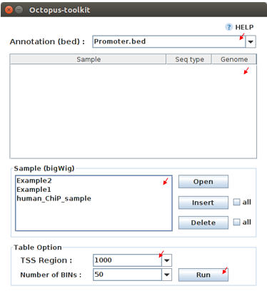

To draw graphs, Octopus-toolkit requires bigWig (signal) files, which are generated by either Public anlaysis or Private analysis. 

* ``bigWig`` : Output of the Public data or Private data analysis.
* ``bed`` : Output of the Peak calling analysis.


Finally, hit the Run button.
The output (plots) will be stored in the Graph directory under the Result folder.

* ``Annotation(bed)``

First, select loci (.bed) of your interest from the Annotation (bed) function.
Second, select samples (.bigWig) of your interest from the Sample list.

* ``TSS Region``

Third, set appropriate paramters from the Table option.
The unit for this option is basepair (bp).

.. image:: _static/Guide/14.TSS-Region.png

The default ranges of TSS-regions are 1000, 2000, 5000 and 10000 bp.

* ``Number of BINs``

The region selected in the TSS region option is divided into n (number of BINs) BINs

The lager the bin size, the smoother the graph can be drawn.

3. set the TSS region and BIN size in the Graph table.
4. Click the Run button.

5-6.Visualization
^^^^^^^^^^^^^^^^^

Quick Start
___________

.. note::
    1. Select the Analysis tab -> Click the IGV function in the Menu bar.
    2. Select output folders (Result/GSExxxxx) of your interest.
    3. In the sample window, select samples and then, click the Insert button.
    4. Check see if all genomes are the same. Only data in the same genome can be loaded into the IGV.
    5. Set the same genome in the Table option.
    6. Click the Run button.

Start analyzing IGV
_____________________


The IGV function is a process of visualizing analyzed data through IGV, a visualization tool. 

IGV uses bigWig files. 

1. Select the Analysis tab -> Click the IGV function in the Menu bar.
2. Select output folders (Result/GSExxxxx) of your interest.

IGV table
_________

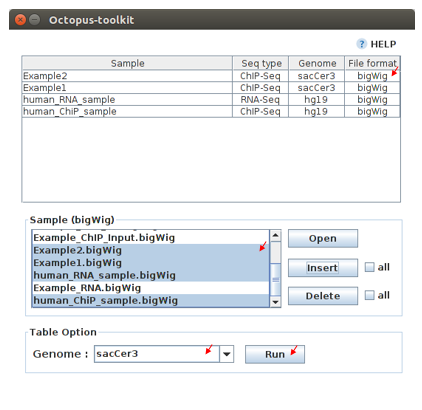

* ``Genome``

Genome option shows the genome of the samples.

3. In the sample window, select samples and then, click the Insert button.
4. Check if all genomes are the same. Only the data in the same genome can be loaded into the IGV.
5. Set the same genome in the Table option.
6. Click the Run button.

Run
___

* Below shows run screen of IGV.

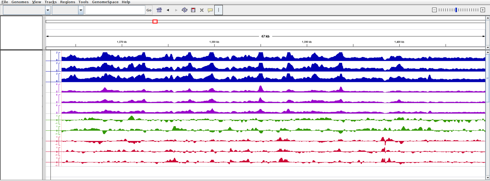

Unlike other tools integrated in Octopus-toolkit, the IGV tool runs separately from the Octopus-toolkit.

.. _output:

5-7.Output (important!)
^^^^^^^^^^^^^^^^^^^^^^^

The output files generated by each process are as follows:

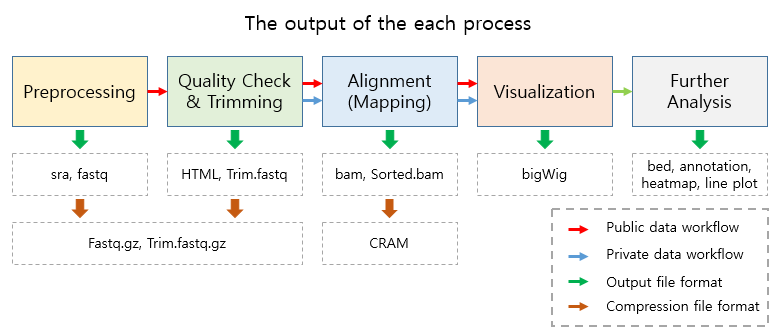

* In the Result folder

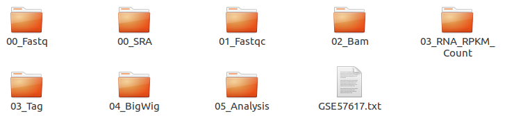

.. list-table::
   :widths: 10 10 10 10
   :header-rows: 1

   * - Folder name
     - Process
     - File format
     - Description
   * - ``00_Fastq``
     - Preprocessing,Trimming
     - ``fastq``, ``Trim.fastq``
     - Save the raw file and trimmed file.
   * - ``00_SRA``
     - Preprocessing
     - ``sra``
     - Store the SRA file downloaded from NCBI
   * - ``01_Fastqc``
     - Quality check
     - ``html``, ``txt``
     - Save the result of the Quality check.
   * - ``02_Bam``
     - Alignment
     - ``bam``, ``sorted.bam``, ``bai``
     - Save the Alignment and sorted files.
   * - ``03_RNA_RPKM_Count``
     - Normalization
     - ``RPKM``, ``Count``
     - Save the calculated RPKM and raw read count tables for the RNA-Seq data.
   * - ``03_Tag``
     - Downstream (motif) analyses by HOMER
     - ``Tag folder``
     - Save the Tag folders created by the Homer tool.
   * - ``04_BigWig``
     - Visualization
     - ``bigWig``
     - Save the bigWig files for visualization
   * - ``05_Analysis``
     - Peak Calling,Annotation
     - ``bed``, ``annotation``
     - Save the peak (.bed) and annotation files.
   * - ``GSE57617.txt``
     - Log file
     - ``txt``
     - Sample.txt is a file that stores the analysis status and information.

5-8.File Naming
^^^^^^^^^^^^^^^

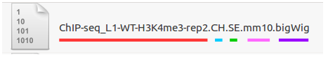

* ``Yellow`` : GSM Accession number
    Only applicable for the public data.

* ``Red`` : ChIP-Seq_L1-WT-H3K4me3-rep2
    Sample file name (title) defined on the GEO website.

* ``Blue`` : Experimental types described below.

.. list-table::
   :widths: 10 10 10 10 10 10
   :header-rows: 1

   * - Experimental types
     - Abbreviation
     - Experimental types
     - Abbreviation
     - Experimental types
     - Abbreviation
   * - ChIP-Seq
     - ``CH``
     - RNA-Seq
     - ``RN``
     - MeDIP-Seq
     - ``ME``
   * - ATAC-Seq
     - ``AT``
     - DNase-Seq
     - ``DN``
     - MNase-Seq
     - ``MN``

* ``Green`` : Sequencing strategy
    SE : Single-End, PE : Paired-End

* ``Pink`` : Reference genome
    Reference Genome

* ``Gray`` : Alignment tool
    RNA-Seq alignment tools. (ht2 : Hisat2, str: STAR)

* ``Puple`` : File extension
    Output Format

.. _full_parameter:

5-9.Full Parameters
^^^^^^^^^^^^^^^^^^^

You can adjust the parameters of 3rd party tools integrated into the Octopus-toolkit.

The 3rd party tools used in Octopus-toolkit : :ref:`3rd party tools<3rd_party_tool>`

Preprocessing
_____________

In the preprocessing step, Octopus-toolkit downloads selected NGS data from NCBI and converts the downloaded (.sra) files to FASTQ files.
The 3rd party tools used in the preprocessing step are Aspera and SRAToolkit(fastq-dump)

* **Transfer rate**

    ``MAX-RATE`` : MAX transfer rate (Only Integers)

    ``MIN-RATE`` : MIN transfer rate (Only Integers)

    ``Overwrite`` : Overwrite-Method, Always(Default), Never, Older, Diff

* **Convert Sra to Fastq (Filtering)**

    ``MIN-Read Length`` : Filter by sequence length >= <Value> (Only Integers)
    
    ``Aligned or unaligned reads`` : Dump only aligned sequence or unaligned sequences, NotUse(Default), Both, Aligned, Unaligned

    ``Quality conversion`` (offset) : Offset to use for quality conversion, 33(Default), 64

    ``Dump biological reads(Only)`` : Dump only biological reads, No(Default)

QC & Trimming
_____________

QC & Trimming is the process of assessing the quality of the reads. If bad sequencing quality are detected, portions of low-quality reads are trimmed.
The 3rd party tools used in QC & Trimming are FastQC and Trimmomatic.

* **Determining the quality of DNA Sequence**

    ``K-Mer`` : Specifies the length of Kmer to look for in the Kmer content module, Specified Kmer length must be between 2 and 10. Default length is 7 if not specified.

    ``Allocated memory`` : Set the momory available on your computer for Quality check. Provides a measure of currently available memory . (Octopus-toolkit option)

* **Trimmed DNA sequence data**

    ``Illumina adapt Sequence`` : Cut adapter and other illumina-specific sequences from the read.

    ``Seed mismatches`` : Specifies the maximum mismatch count which will still allow a full match to be performed

    ``Palindrome clip threshold`` : Specifies how accurate the match between the two 'adapter ligated' reads must be for PE palindrome read alignment.

    ``Simple clip threshold`` : Specifies how accurate the match between adapter or any sequence must be against a read.

    ``Window size`` : specifies the number of bases to be averaged.

    ``Average quality`` : Specifies the average quality required.

    ``LEADING`` : Specifies the minimum quality required to keep a base.

    ``TRAILING`` : Specifies the minimum quality required to keep a base.

    ``HEADCROP`` : The number of bases to keep, from the start of the read.

    ``TAILCROP`` : The number of bases to remove from the start of the read.

    ``Minimum length of reads to be kept`` : Specifies the minimum length of reads to be kept.

Alignment-Hisat2
________________

Alignment is the process of mapping reads to a reference genome.
The 3rd party tool used in Alignment is Hisat2.

* **Input**

    ``Skip N read`` : Skip the first <int> reads/pairs in the input (none)

    ``Stop after aligning N reads`` : Stop after first <int> reads/pairs (no limit)

    ``Trim N bases 5' end`` : Trim <int> bases from 5'/left end of reads (0)

    ``Trim N bases 3' end`` : Trim <int> bases from 3'/right end of reads (0)

* **Scoring**

    ``Ambiguous read penalty`` : Penalty for non-A/C/G/Ts in read/ref

    ``Mismatch penalty`` : Max and min penalties for mismatch; lower qual = lower penalty <2,6>

    ``Soft-Clipping penalty`` : Max and min penalties for soft-clipping; lower qual = lower penalty <1,2>

    ``Read gap penalty`` : Read gap open, extend penalties (5,3)

    ``Reference gap penalty`` : Reference gap open, extend penalties (5,3)

* **Alignment**

    ``Ignore all quality values`` : Treat all quality values as 30 in Phred scale (no)

    ``Do not align reverse of read`` : Do not align forward (original) version of read (no)

    ``Do not align forward of read`` : Do not align reverse-complement version of read (no)

* **Spliced alignment**

    ``Do not spliced alignment`` : Disable spliced alignment

    ``Canonical`` : Penalty for a canonical splice site (0)

    ``Non-canonical`` : Penalty for a non-canonical splice site (12)

    ``MIN-Length`` : Minimum intron length (20)

    ``MAX-Length`` : Maximum intron length (500000)

Alignment-STAR
________________

Alignment is the process of mapping reads to a reference genome.
The 3rd party tool used in Alignment is STAR (RNA-Seq only).

* **Alignment**

    ``AlignIntronMin`` : Minimum intron size: genomic gap is considered intron if its\nlength>=alignIntronMin, otherwise it is considered as Deletion (21)

    ``AlignIntronMax`` : Maximum intron size, if 0, max intron size will be determined by\n(2ˆwinBinNbits)*winAnchorDistNbins (0)

    ``AlignMatesGapMax`` : Maximum gap between two mates, if 0, max intron gap will be determined by (2ˆwinBinNbits)*winAnchorDistNbins (0)

* **Output Filtering**

    ``OutFilterMultimapNmax`` : int: maximum number of loci the read is allowed to map to. Alignments (all of them) will be output only if the read maps to no more loci than this value. Otherwise no alignments will be output, and the read will be counted as ”mapped to too many loci” in the Log.final.out. (10)

    ``OutFilterMismatchNmax`` : int: alignment will be output only if it has no more mismatches than this value. (10)

    ``OutFilterMismatchNoverLmax`` : float: alignment will be output only if its ratio of mismatches to *mapped* length is less than or equal to this value.(0.3)


    
Visualization-TagDirectory
__________________________

Visualization-TagDirectory is the process of creating Tag directories.
The 3rd party tool used in TagDirectory is Homer.

* **Create tag directory**

    ``Fragment-Length`` : (Set estimated fragment length - given: use read lengths), By default treats the sample as a single read ChIP-Seq experiment

    ``Maximum tags per bp`` : Maximum tags per bp, default: no maximum

    ``Flip the strands of each read`` : Flip strand of each read, i.e. might want to use with some RNA-seq

    ``Length of the read to keep`` : Filter reads with lengths outside this range

Visualization-MakeBigWig
________________________

MakeBigWig is the process of creating bigWig files from the Tag directories.
The 3rd party tool used in MakeBigWig is Homer.

* **Make visualization data**

    ``Size of the bigWig files`` : Size of file, when gzipped, default: 1e10, i.e. no reduction

    ``Fragment Length`` : Approximate fragment length, default: auto

    ``Resolution`` : Resolution, in bp, of file, default: 1, ``avg`` report average coverage if resolution is larger than 1bp, default: max is reported

    ``Tags per bp to count`` : Minimum and maximum tags per bp to count, default: no limit

    ``Plot negative values`` : Plot negative values, i.e. for - strand transcription

* **Normalization**

    ``Normalize the total number of reads`` : Total number of tags to normalize experiment to, default: 1e7

    ``Set the standard length`` : Expected length of fragment to normalize to [0=off], default: 100

PeakCalling-ChIP-Seq/Histone
____________________________

PeakCalling is the process of detecting enriched regions (peaks) by mapped reads.
The 3rd party tool used in PeakCalling is Homer.

* **ChIP-Seq/Histone**

    ``Peak size`` : Peak size, default: 0

    ``MIN-Distance`` : Minimum distance between peaks, default: 0 (peak size x2)

    ``Genome Size`` : Set effective mappable genome size, default: 2e9

    ``Fragment Length`` : Approximate fragment length, default: auto

    ``Input Fragment Length`` : Approximate fragment length of input tags, default: auto

    ``Tag`` : Maximum tags per bp to count, 0 = no limit, default: auto

    ``Input tag`` : Maximum tags per bp to count in input, 0 = no limit, default: auto

    ``Tag count to normalize`` : Tag count to normalize to, default 10000000

    ``Region Resolution`` : Extends start/stop coordinates to cover full region considered "enriched" (YES), ``Resolution`` number of fractions peaks are divided in when extending 'regions', def: 4

PeakCalling-Peak Filter
_______________________

* **Peak Filter**

    ``Fold Enrichment(Input)`` : Fold enrichment over input tag count, default: 4.0

    ``Poisson p-value threshold(Input)`` : Poisson p-value threshold relative to input tag count, default: 0.0001

    ``Fold Enrichment(Local)`` : Fold enrichment over local tag count, default: 4.0

    ``Poisson p-value threshold(Local)`` : Poisson p-value threshold relative to local tag count, default: 0.0001

    ``Fold Enrichment(Unique Tag)`` : Fold enrichment limit of expected unique tag positions, default: 2.0

    ``Local Size(Local tag)`` : Region to check for local tag enrichment, default: 10000

    ``Input Size(Input tag)`` : Size of region to search for control tags, default: 0

    ```False Discovery Rate`` : False discovery rate, default = 0.001

    ``Poisson p-value cutoff`` : Set poisson p-value cutoff, default: 0.001

    ``Set # of tags`` : Set # of tags to define a peak, default: 25

    ``Set # of normalized tags`` : Set # of normalized tags to define a peak, by default uses 1e7 for norm

PeakCalling-Other analysis
__________________________

* **MethylC-Seq/BS-Seq**

    ``Find Region`` : Find unmethylated/methylated regions, default: -unmethyC

    ``Methyl Threshold`` : Methylation threshold of regions, default: avg methylation/2

    ``Min cytosine per Methyl`` : Minimum number of cytosines per methylation peak, default: 6

