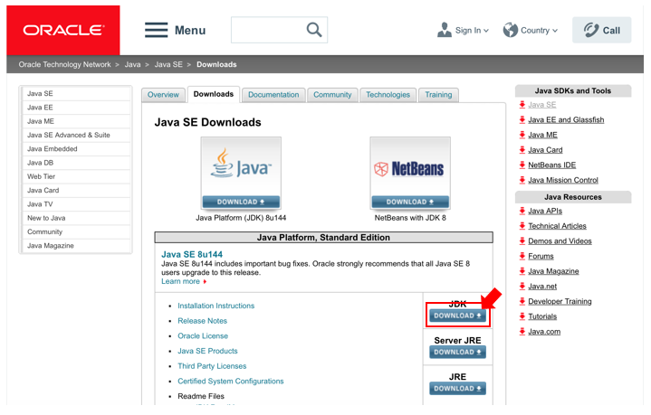
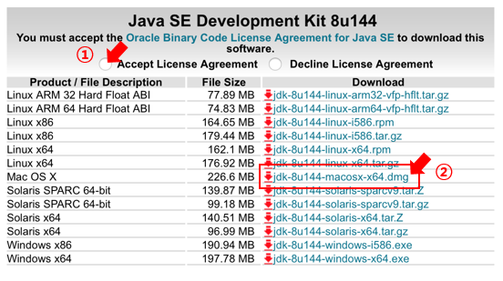
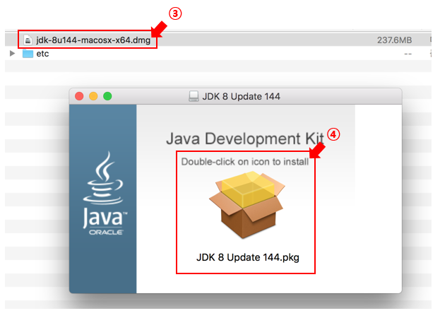

==============
1.Installation
==============

1-1.Download
------------

.. note::
    Applications in the ``Requirement`` section must be installed on your computer before running the Octopus-toolkit.

1. Octopus-toolkit_2.1.0 : (:download:`Octopus-toolkit<_templates/Octopus-toolkit.zip>`) (64bit)
2. Octopus-toolkit_mac_2.1.0 : (:download:`Octopus-toolkit_mac<_templates/Octopus-toolkit_mac.zip>`)

1-2.Installation Movie Clip
---------------------------

* Tutorial for installation

* Ubuntu ``16.04`` version. (`Youtube - Ubuntu 16.04 <https://youtube.com/watch?v=K0OpNxXK534&t=2s>`_)

* CentOS ``6.9`` version. (`Youtube - CentOS 6.9 <https://youtube.com/watch?v=ZQYrBumI73c&feature=youtu.be>`_) - Currently not supported.

* CentOS ``7`` version. (`Youtube - CentOS 7 <https://youtube.com/watch?v=jJvu3cu5mCc&t=8s>`_)

* MacOS ``Sierra 10.12.6`` version (`Youtube - MacOS Sierra 10.12.6 <https://youtube.com/watch?v=Ltm5MFZJN-E>`_)

.. _requirement:

1-3.Requirement
---------------

To run the Octopus-toolkit, ``Java 8`` (JDK, Java Development ToolKit) or higher, must be installed on your computer.

* Ubuntu, Mint (``Ubuntu 16.04 or Mint18`` )::

    sudo apt-get update
    sudo apt-get install openjdk-8-jdk

* Ubuntu (``14.04``)::

    sudo add-apt-repository ppa:openjdk-r/ppa
    sudo apt-get update
    sudo apt-get install openjdk-8-jdk
    sudo update-alternatives --config java
    sudo update-alternatives --config javac

* Fedora, CentOS(``Fedora 22~25 or CentOS 7`` )::

    sudo yum update
    sudo yum install java-1.8.0-openjdk

Octopus-toolkit utilizes several libraries for analysis.
Each operating system such as ubuntu, mint and fedora differ in ways to install the applications.
Please follow the installation guide below.

1-4.Ubuntu(14.04,16.04), Mint(18)
---------------------------------

To run the Octopus-toolkit, you must install the following libraries: ``zlib1g``, ``libpng12``, ``libncurses5``, ``g++``

* ``zlib1g-dev`` ::
    
    sudo apt-get install zlib1g-dev

* ``libpng12-dev`` ::
    
    sudo apt-get install libpng12-dev

* ``libncurses5-dev`` ::

    sudo apt-get install libncurses5-dev

* ``g++`` ::

    sudo apt-get install build-essential

OR ::

    sudo apt-get install zlib1g-dev libpng12-dev libncurses5-dev build-essential

If Ubuntu version is ``14.04``, you must install the following libraries: ``liblzma-dev``, ``libbz2-dev``

* ``liblzma-dev`` ::

    sudo apt-get install liblzma-dev

* ``libbz2-dev`` ::
 
    sudo apt-get install libbz2-dev

OR ::
  
    sudo apt-get install liblzma-dev libbz2-dev

1-5.Fedora(22~25), CentOS(7)
----------------------------

To run the Octopus-toolkit, you must install the following libraries: ``zlib``, ``libpng`` , ``libpng12``, ``ncurses``, ``gcc-c++``, ``libbz2``, ``liblzma``

* ``zlib-devel`` ::

    sudo yum install zlib-devel.x86_64

* ``libpng-devel`` ::

    sudo yum install libpng-devel.x86_64

* ``libpng-devel12`` ::

    sudo yum install libpng12-devel.x86_64

* ``ncurses-devel`` ::

    sudo yum install ncurses-devel.x86_64

* ``gcc-c++`` ::

    sudo yum install gcc-c++

* ``libbz2`` ::

    sudo yum install bzip2-devel

* ``liblzma`` ::

    sudo yum install xz-devel

OR ::

    sudo yum install zlib-devel.x86_64 libpng-devel.x86_64 libpng12-devel.x86_64 ncurses-devel.x86_64 gcc-c++ bzip2-devel xz-devel

.. _mac:

1-6.MacOS(Sierra_10.12.6)
-------------------------

.. note::
    Applications in the ``Requirement`` section must be installed on your computer before running the Octopus-toolkit (Mac version).

To run the Octopus-toolkit, ``Java 8`` (JDK, Java Development ToolKit) or higher, must be installed on your computer. (:download:`Octopus-toolkit_mac_2.1.0<_templates/Octopus-toolkit_mac.zip>`)

* ``Java 8`` (JDK, Java Development ToolKit) or higher::

    Link : http://www.oracle.com/technetwork/java/javase/downloads/index.html

0. Click the JDK DOWNLOAD Button

1. Click the Accept License Agreement radio button.
2. Click the jdk-(version)-macosx-x64.dmg 

3. Go to the Download folder. Execute the downloaded installation file.
4. Double click on icon to install.

Octopus-toolkit utilizes several libraries for analysis. Please follow the installation guide below.

* Xcode Update::

    xcode-select --install

* Library (wget, liblzma,libpng)::

    /usr/bin/ruby -e "$(curl -fsSL https://raw.githubusercontent.com/Homebrew/install/master/install)"
    brew install wget    
    brew install xz
    brew install libpng

.. _graph:

1-7.R (3.1)
-----------

To draw heatmap and Line plot, ``R (3.1)`` or higher version of R must be installed on your computer.

* Ubuntu, Mint (``Ubuntu 16.04 or Mint18`` )::

    sudo apt-get install r-base

* Ubuntu (``14.04``)::

    sudo apt-get update
    sudo apt-get install r-base
    sudo apt-key adv --keyserver keyserver.ubuntu.com --recv-keys E084DAB9
    sudo add-apt-repository ppa:marutter/rdev
    sudo apt-get update
    sudo apt-get upgrade
    sudo apt-get install r-base

* Fedora (``Fedora 22~25`` )::

    sudo yum install R

* CentOS (``CentOS 7`` )::

    sudo yum install epel-release
    sudo yum install R

* MacOS (``Sierra``)::

    /usr/bin/ruby -e "$(curl -fsSL https://raw.githubusercontent.com/Homebrew/install/master/install)"
    brew install r

