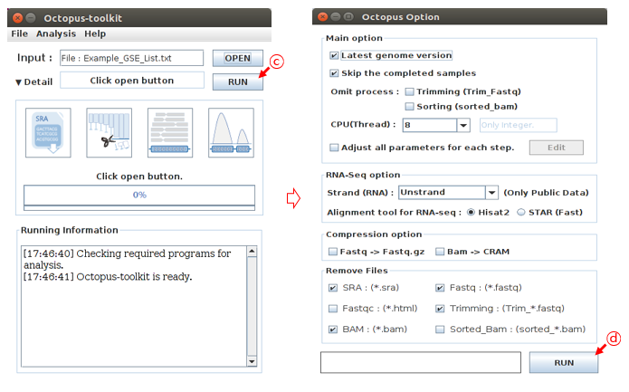
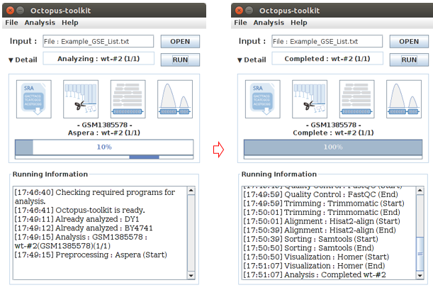
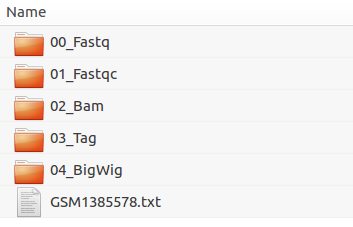

=============
0.Quick Start
=============

To use the Octopus-toolkit right away, please follow these tutorials:

0-1. Installation Movie Clip
^^^^^^^^^^^^^^^^^^^^^^^^^^^^

Tutorial for installation. (`Youtube <https://youtube.com/watch?v=K0OpNxXK534&t=2s>`_)

0-2. Ubuntu(16.04), Mint(18) (We highly recommend to use Ubuntu)
^^^^^^^^^^^^^^^^^^^^^^^^^^^^^^^^^^^^^^^^^^^^^^^^^^^^^^^^^^^^^^^^

* Commands (:download:`Quick_Start(Ubuntu,mint).txt<_templates/Quick_Start(Ubuntu,mint).txt>`):: 
   
   sudo apt-get update
   sudo apt-get install openjdk-8-jdk
   sudo apt-get install zlib1g-dev libpng12-dev libncurses5-dev build-essential r-base
   wget http://octopus-toolkit2.readthedocs.io/en/latest/_downloads/Octopus-toolkit.zip -O Octopus-toolkit.zip
   unzip Octopus-toolkit.zip
   cd Octopus-toolkit/
   java -jar Octopus-toolkit.jar

0-3. Fedora(25)
^^^^^^^^^^^^^^^

* Commands (:download:`Quick_Start(Fedora).txt<_templates/Quick_Start(Fedora).txt>`):: 

   sudo yum update
   sudo yum install java-1.8.0-openjdk
   sudo yum install zlib-devel.x86_64 libpng-devel.x86_64 libpng12-devel.x86_64 ncurses-devel.x86_64 gcc-c++ bzip2-devel xz-devel R
   wget http://octopus-toolkit2.readthedocs.io/en/latest/_downloads/Octopus-toolkit.zip -O Octopus-toolkit.zip
   unzip Octopus-toolkit.zip
   cd Octopus-toolkit/
   java -jar Octopus-toolkit.jar

0-4. CentOS(7)
^^^^^^^^^^^^^^

* Commands (:download:`Quick_Start(CentOS).txt<_templates/Quick_Start(CentOS).txt>`):: 

   sudo yum update
   sudo yum install java-1.8.0-openjdk
   sudo yum install zlib-devel.x86_64 libpng-devel.x86_64 libpng12-devel.x86_64 ncurses-devel.x86_64 gcc-c++ bzip2-devel xz-devel
   sudo yum install epel-release
   sudo yum install R
   wget http://octopus-toolkit2.readthedocs.io/en/latest/_downloads/Octopus-toolkit.zip -O Octopus-toolkit.zip
   unzip Octopus-toolkit.zip
   cd Octopus-toolkit/
   java -jar Octopus-toolkit.jar

0-5. MacOS(Sierra 10.12.6)
^^^^^^^^^^^^^^^^^^^^^^^^^^

.. note::
    Please refer to the link below for MacOS
     Link : :ref:`1.Installation 1-6.MacOS(Sierra_10.12.6)<mac>`

0-6. Quick Run (Public data)
^^^^^^^^^^^^^^^^^^^^^^^^^^^^

Example GSE file (:download:`Example_GSE_List.txt<_templates/Example_GSE_List.txt>`)

* ``A`` : Click the OPEN button.
* ``B`` : Select the ``Example_GSE_List.txt`` file.

.. image:: _static/Quick/1.Quick_run.png

* ``C`` : Click the RUN button.
* ``D`` : Set parameters. Then, click the RUN button.

* Octopus-toolkit will sequentialy download and process the data specified in the list file. The analysis may take some time.

* Below shows output file of Octopus-toolkit

