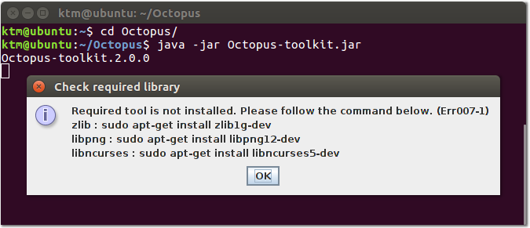

===
Run
===

.. note::
    ``Requirements`` must be installed on a computer before running the Octopus-toolkit. (:ref:`Installation <requirement>`)

How to run the Octopus-toolkit
------------------------------

* Download `Octopus-toolkit <https://github.com/kangk1204/Octopus/archive/master.zip>`_ and uncompress to the ``folder`` where you want it to be installed.
* Open the terminal application and type the command below ::

    cd /Path/
    java -jar Octopus-toolkit.jar

* Path : The ``folder`` where Octopus-toolkit is installed.

Or Command (Download ~ Run) ::

    wget https://github.com/kangk1204/Octopus/archive/master.zip -O Octopus-master.zip
    unzip Octopus-master.zip
    cd Octopus-master/
    java -jar Octopus-toolkit.jar

* Not installed Requirement. (Java 8 version) : (:ref:`Err007-1<err_007>`) 

.. image:: _static/Error/Err007_Not_Install_Java.png

* Not installed Requirement. (Libraries in system) : (:ref:`Err007-1<err_007>`) 

* After completing the Requirement installation.

.. image:: _static/Complete_Installing_Requirement.png

Java Virtual Machine(VM) heap memory limited
--------------------------------------------

Tools that analyze NGS require a large amount of memory. (Recommend : ``32+`` Gb RAM).

If you get errors related to running out of memory on your computer, should increase the heap memory of the Java Virtual Machine. 

* If your memory is less than 16Gb::

    java -jar Octopus-toolkit.jar -Xms2G -Xmx16G -XX:MaxPermSize=16G -XX:PermSize=2G

.. csv-table::
    :header: "Argument","Description","Recommend"

    ``Xms``,Initial Heap Size,``2Gb``
    ``Xmx``,Max Heap Size, Maximum of RAM
    ``XX:PermSize``,Initial Permanent Size,``2Gb``
    ``XX:MaxPermSize``,Max Permanent Size, Maximum of RAM
  
