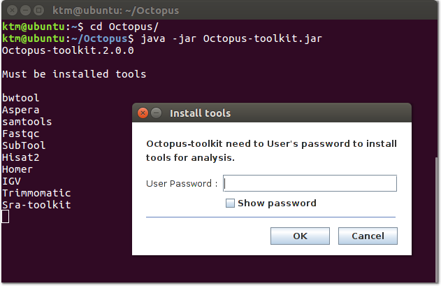

=====
2.Run
=====

.. note::
    ``Requirements`` must be installed on a computer before running the Octopus-toolkit. (:ref:`Installation <requirement>`)

2-1.How to run the Octopus-toolkit
----------------------------------

Please follow the movie clip (`Youtube <https://youtube.com/watch?v=K0OpNxXK534&t=2s>`_)

* Download (:download:`Octopus-toolkit<_templates/Octopus-toolkit.zip>`) and uncompress it to the ``folder`` where you want it to be installed.
* Open the terminal application (cmd) and type the below command in  ::

    cd Octopus-toolkit/
    java -jar Octopus-toolkit.jar

Or Command (Download ~ Run) ::

    wget http://octopus-toolkit2.readthedocs.io/en/latest/_downloads/Octopus-toolkit.zip -O Octopus-toolkit.zip
    unzip Octopus-toolkit.zip
    cd Octopus-toolkit/
    java -jar Octopus-toolkit.jar

    
* No Java installation could be found. (Java 8 version) : (:ref:`Err007-1<err_007>`) 

.. image:: _static/Error/Err007_Not_Install_Java.png

* No prerequisite were found. (Libraries in system) : (:ref:`Err007-1<err_007>`) 

.. image:: _static/Error/Err007_Not_Install_Libraries.png

* Password for permission

2-2.Java Virtual Machine(VM) heap memory limited
------------------------------------------------

Octopus-toolkit requires at least 8 Gb of the memory (32 Gb of memory for processing human/mouse RNA-seq) (Recommend : ``32+`` Gb RAM).

If you get errors related to running out of memory, please increase the heap memory of the Java Virtual Machine. 

* If your memory is less than 16Gb::

    java -jar Octopus-toolkit.jar -Xms2G -Xmx16G -XX:MaxPermSize=16G -XX:PermSize=2G

.. csv-table::
    :header: "Argument","Description","Recommend"

    ``Xms``,Initial Heap Size,``2Gb``
    ``Xmx``,Max Heap Size, Maximum of RAM
    ``XX:PermSize``,Initial Permanent Size,``2Gb``
    ``XX:MaxPermSize``,Max Permanent Size, Maximum of RAM
  
