==========
6.Tutorial
==========

The tutorial was written to help you to use Octopus-toolkit easily.

.. csv-table::
   :header: "Tutorial ID","Description"
   :widths: 10, 35

    :ref:`6-1.Public data<tutorial1>`,How to analyze Public data by entering ``GEO accession number``.
    :ref:`6-2.Public data<tutorial2>`,How to analyze Public data by loading ``list`` of the GEO accession numbers.
    :ref:`6-3.Private data<tutorial3>`,How to make the Private table using ``user's data`` and analyze it.
    :ref:`6-4.Private data<tutorial4>`,How to make the Private table using user's ``Multi-lane`` data and analyze it.
    :ref:`6-5.Peak Calling<tutorial5>`,How to analyze ``Peak Calling`` using analyzed data.
    :ref:`6-6.Graph<tutorial6>`,How to draw ``Graph`` using analyzed data.
    :ref:`6-7.IGV<tutorial7>`,How to utilize ``IGV`` using analyzed data.
  
.. _tutorial1:
 
6-1.Public data (Single GSE/GSM)
^^^^^^^^^^^^^^^^^^^^^^^^^^^^^^^^

.. note::
    ``6-1.Public data (Single GSE/GSM)`` describes how to use published data by entering a single GEO accession number. 

The way to analyze published data is very simple. Enter GEO accession number in the input text area. Then click the Run button and Octopus-toolkit option window will appear in front of you. After selecting the options for analysis in the option window, click the Run button to start analysis.

* ``GEO accession number`` : `GSE48685 <https://www.ncbi.nlm.nih.gov/geo/query/acc.cgi?acc=GSE48685>`_ (ChIP-Seq:10, RNA-Seq:1)

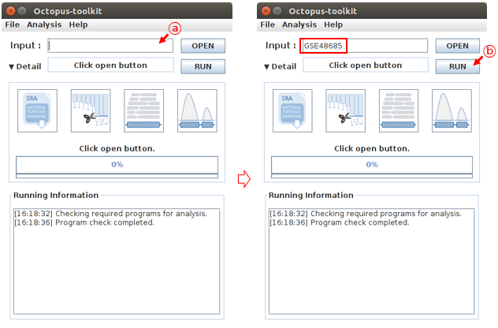

* ``A`` : Enter GSE48685 in the input text area.
* ``B`` : Click the Run button
 
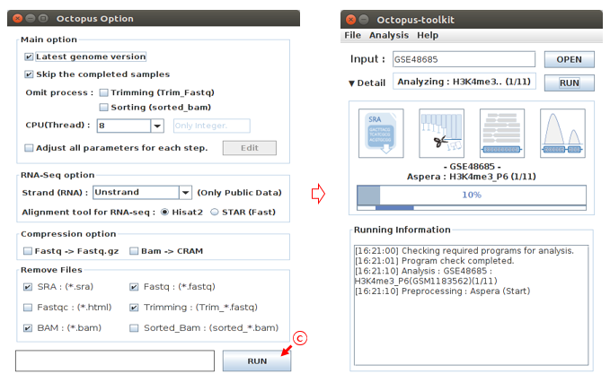

* ``C`` : Select the options to analyze and click the Run button. (Option : Defalut)

Finally, Octopus-toolkit automatically analyzes the GSE48685 samples and you just have to wait for the results. 

.. _tutorial2:

6-2.Public data (Multi GSE/GSM)
^^^^^^^^^^^^^^^^^^^^^^^^^^^^^^^

.. note::
    ``6-2.Public data (Multi GSE/GSM)`` describes How to analyze Public data by loading list of the GEO accession numbers.

When you use the published data in NCBI, you may want to analyze some of the samples in GSExxx. (Ex) When you want to analyze only GSM1183563, GSM1183564 among samples of GSE48685.(GSE48685 : 11 Samples)

Or you may want to process multiple samples at once.

First, you create a GEO accession number list. The list format is shown below. (:download:`example.list<_templates/GEO_Accession_number.list>`)

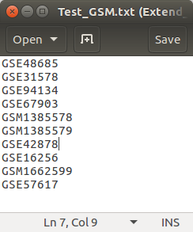

Unlike, single GSE/GSM(Public data) analysis, click the Open button and load the GEO list file which you created. 

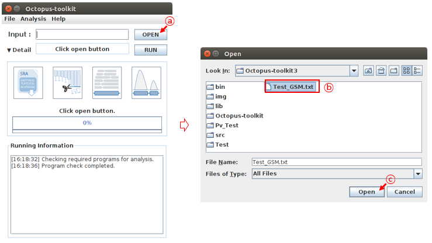

* ``A`` : Click the Open button
* ``B`` : Select the GEO accession number list file.
* ``C`` : Click the Open button

After checking the input text area, click the Run button and Octopus-toolkit option window will appear in front of you. After selecting the options for analysis in the option window, click the Run button to start analysis.

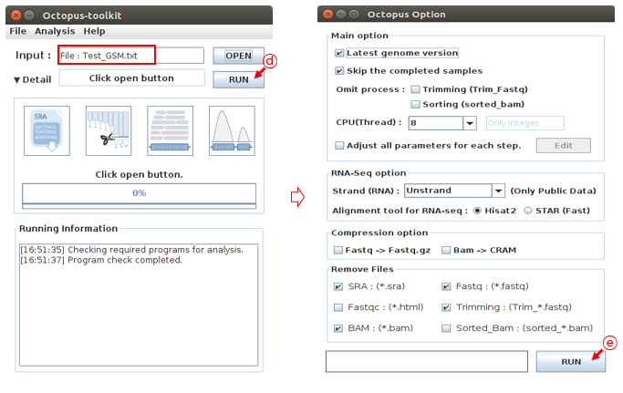

* ``D`` : Click the Run button
* ``E`` : Select the options to analyze and click the Run button. (Option : Defalut)

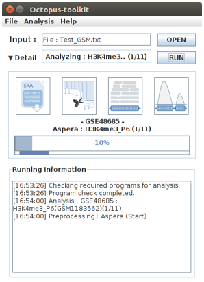

Finally, Octopus-toolkit will automatically analyze the loaded GEO accession numbers and you just have to wait for the results.

.. _tutorial3:

6-3.Private data (Basic)
^^^^^^^^^^^^^^^^^^^^^^^^

.. note::
    ``6-3.Private data (Basic)`` describes How to make the Private table using user's data and analyze it.

The user can proceed with the analysis according to the given situation. We assumed the situation arbitrarily for the tutorial.

.. csv-table:: Analysis situation.
   :header: "NO","File name","Genome","Seq Type","SE or PE","Strand"
   :widths: 5,20,10,10,10,10 

    1,Private_ChIP-Seq_Mouse.fastq,mm10,ChIP-Seq,Single-End,Not use
    2,Private_RNA-Seq_Human_1.fastq,hg38,RNA-Seq,Paired-End,FR-Firststrand
    3,Private_RNA-Seq_Human_2.fastq,hg38,RNA-Seq,Paired-End,FR-Firststrand
    
First, User click Private Data in the Analysis menu bar.

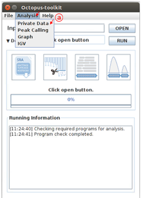

* ``A`` : Click the Private Data in the Analysis menu bar.

You select the file in the given situation and click the Open button.

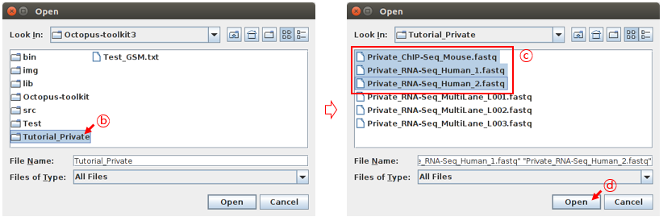

* ``B`` : select the folder
* ``C`` : Select the files
* ``D`` : Click the Open button

When the selection of the files to be analyzed is completed, the Private Table will appear.

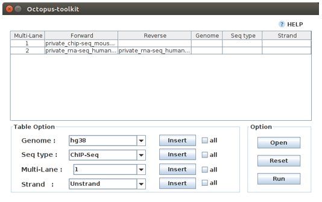

First, let's write information about 1.Private_ChIP-Seq_Mouse.fastq. The information in this sample is the mm10 genome, ChIP-Seq and Single-End.

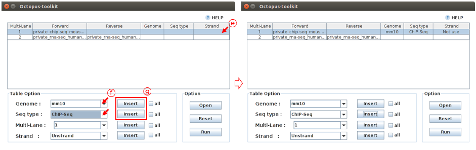

* ``E`` : Select the Private_ChIP-Seq_Mouse.fastq sample.
* ``F`` : Select information about this sample. (Genome : ``mm10``, Seq-Type : ``ChIP-Seq``)
* ``G`` : Click the Insert button

Second, let's write information about 2 and 3.Private_RNA-Seq_Human. The information in this sample is the hg38 genome, RNA-Seq, Paired-End and FR-Firststrand. 

Octopus-toolkit recognizes Paired-End as _1 and _2.

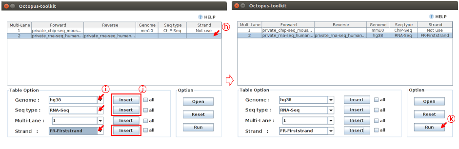

* ``H`` : Select the Private_RNA-Seq_Human.fastq sample.
* ``I`` : Select information about this sample. (Genome : ``hg38``, Seq-Type : ``RNA-Seq``, Strand : ``FR-Firststrand``)
* ``J`` : Click the Insert button
* ``K`` : Click the Run button

Octopus-toolkit option window will appear in front of you. After selecting the options for analysis in the option window, click the Run button to start analysis.

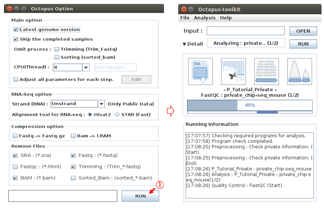

* ``L`` : Click the Run button.

.. _tutorial4:

6-4.Private data (Multi-lane)
^^^^^^^^^^^^^^^^^^^^^^^^^^^^^

.. note::
    ``6-4.Private data (Multi-lane)`` describes How to make the Private table using user's Multi-lane data and analyze it.

.. csv-table:: Analysis situation.
   :header: "NO","File name","Genome","Seq Type","SE or PE","Strand"
   :widths: 5,20,10,10,10,10 

    1,Private_RNA-Seq_MultiLane_L001.fastq,hg38,ChIP-Seq,Single-End,Not use
    2,Private_RNA-Seq_MultiLane_L002.fastq,hg38,ChIP-Seq,Single-End,Not use
    3,Private_RNA-Seq_MultiLane_L003.fastq,hg38,ChIP-Seq,Single-End,Not use

First, User click Private Data in the Analysis menu bar.

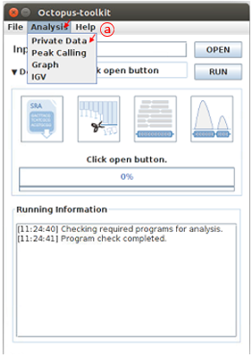

* ``A`` : Click the Private Data in the Analysis menu bar.

You select the file in the given situation and click the Open button.

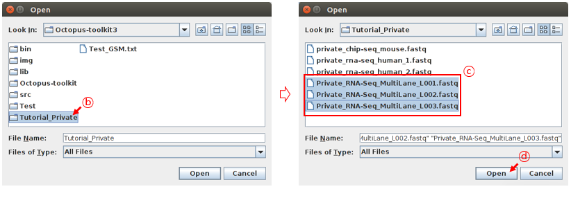

* ``B`` : select the folder
* ``C`` : Select the files
* ``D`` : Click the Open button

When the selection of the files to be analyzed is completed, the Private Table will appear.

First, let’s write information about Private_RNA-Seq_MultiLane.fastq. The information in this sample is the hg38 genome, ChIP-Seq and Single-End.

Since all samples have the same information, user use the all button to enter the information at once.

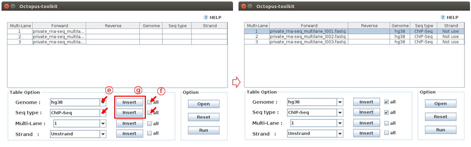

* ``E`` : Select information about this sample. (Genome : ``hg38``, Seq-Type : ``ChIP-Seq``)
* ``F`` : Click the all button
* ``G`` : Click the Insult button

To specify Multi-Lane data, No number is relevant, but all Multi-Lane data must have the same number.

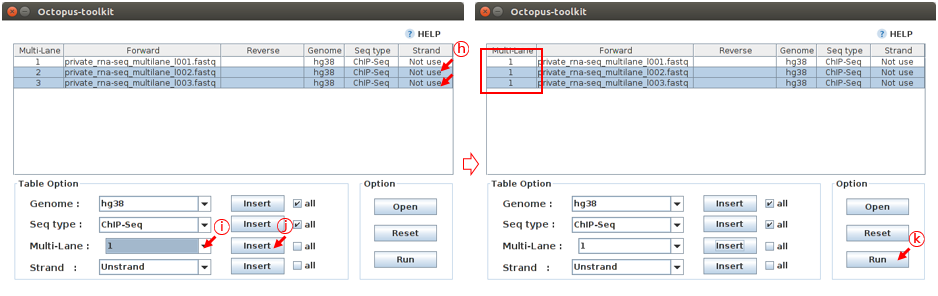

* ``H`` : Select the Private_RNA-Seq_MultiLane Files.
* ``I`` : Select the number 1 (Multi-Lane)
* ``J`` : Click the Insult button
* ``K`` : Click the Run button

Octopus-toolkit option window will appear in front of you. After selecting the options for analysis in the option window, click the Run button to start analysis.

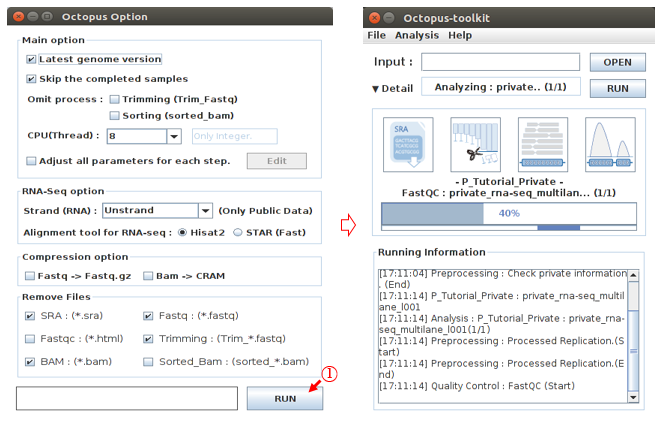

* ``L`` : Click the Run button

.. _tutorial5:

6-5.Peak Calling
^^^^^^^^^^^^^^^^

.. note::
    ``6-5.Peak Calling`` describes How to analyze Peak Calling using analyzed data.

The user can analyze Peak Calling using data analyzed in 6-1 ~ 6-4.

The situation for the user to analyze is as follows.

.. csv-table:: Analysis situation.
   :header: "NO","Sample name","Input/Control/IgG","Style","Result Path"
   :widths: 5,10,10,10,10

    1,STAT5A_P6,Input_P6,Transcription Factor,"Result/GSE48685"

First, User click Peak Calling in the Analysis menu bar.

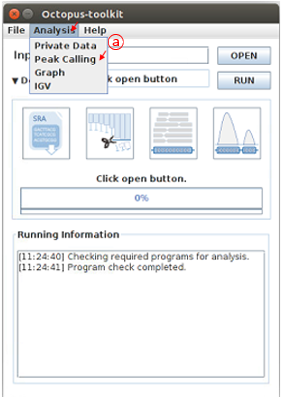

* ``A`` : Click the Peak Calling in the Analysis menu bar.

The results of the already analyzed data are stored in the Result folder. In the Result folder, select the folder that contains the data to be analyzed. (GSE48685)

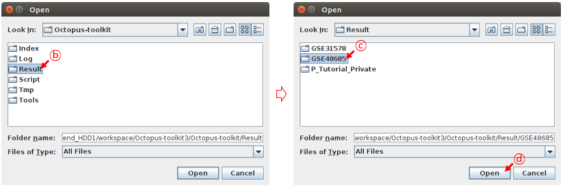

* ``B`` : Select the Result folder.
* ``C`` : Select the GSE48685 folder.
* ``D`` : Click the Open button.

When the selection of the folder to be analyzed is completed, the Peak Calling Table will appear.

The analyzed samples from the loaded GSE48685 are output in the sample area.

First, user adds the given sample in the situation, to the Peak Calling table. 

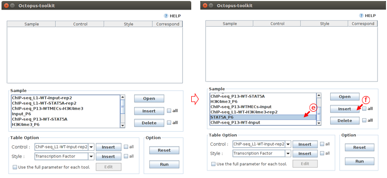

* ``E`` : Select the STAT5A_P6
* ``F`` : Click the Insert button

Then Create information about the added sample by selecting it from the Table option.

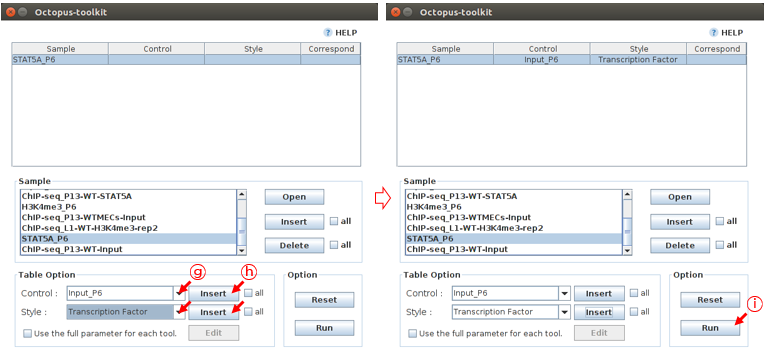

* ``G`` : Select the information about STAT5A_P6 (Control : ``Input_P6``, Style : ``Transcription Factor``)
* ``H`` : Click the Insert button
* ``I`` : Click the Run button

Peak Calling analysis for STAT5A_P6 starts based on the registered information.

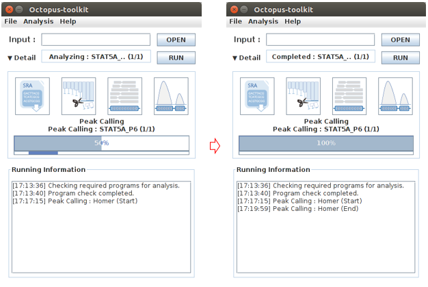

Peak Calling analysis results can be seen in the GSE48685 folder.

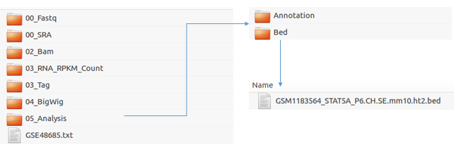

* ``Result Path`` : Octopus-toolkit/Result/GSE48685

.. _tutorial6:

6-6.Graph
^^^^^^^^^

.. note::
    ``6-6.Graph`` describes How to draw Graph using analyzed data.

Octopus-toolkit provides a heatmap and a line plot. The user can draw Graph using data analyzed in 6-1 ~ 6-4 and 6-5.

6-6.Graph tutorial describes how to draw Graph using STAT5A_P6 (GSE48685), M_Bcl6_rep2_G50(GSE31578) and MH_STAT5_rep2_G41(GSE31578) based on the analyzed STAT5A_P6.bed in 6-5.Peak Calling tutorial.

.. csv-table:: Analysis situation.
   :header: "NO","Sample name","Base(Annotation)"
   :widths: 5,10,10

    1,STAT5A_P6,O
    2,M_Bcl6_rep2_G50,X
    3,MH_STAT5_rep2_G41,X

* Option : +- ``1000 bp`` based on TSS, Bin Size : ``100``
   
First, User click Graph in the Analysis menu bar.

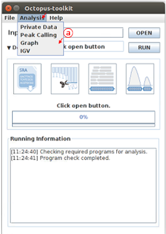

* ``A`` : Click the Graph in the Analysis menu bar.

The results of the already analyzed data are stored in the Result folder. In the Result folder, select the folder that contains the data to be analyzed. (GSE48685,GSE31578)

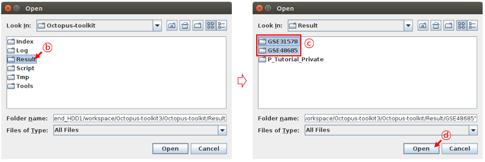

* ``B`` : Select the Result folder.
* ``C`` : Select the GSE48685, GSE31578 folder.
* ``D`` : Click the Open button.

The user selects the Annotation file (STAT5A_P6) in the Graph Table. Then, the user selects 3 samples given in the situation and add them to the table.

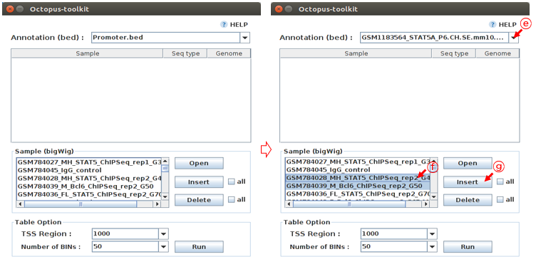

* ``E`` : Select STAT5A_P6_CH.SE.mm10
* ``F`` : Select 3 samples given in the situation.
* ``G`` : Click the Insult button.

In the Table option, the user select the values for the TSS region and Number of BINs. Click the Run button to start the Graph analysis. 

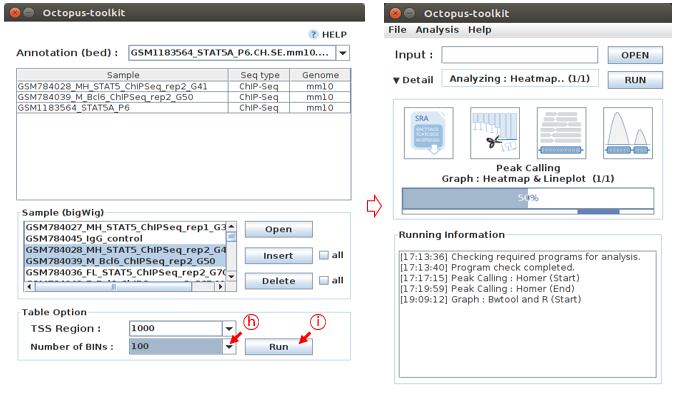

* ``H`` : Select the 1000 in TSS region and 100 in Number of BINs 
* ``I`` : Click the Run button

Graph analysis results can be seen in the Graph folder.

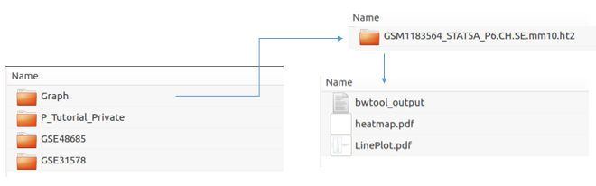

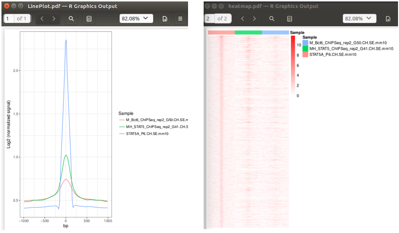

.. _tutorial7:

6-7.IGV
^^^^^^^

.. note::
    ``6-7.IGV`` describes How to utilize IGV using analyzed data.

IGV analysis shows analyzed visualization format data using Integrative Genomics Viewer(IGV). The user can utilize IGV using data analyzed in 6-1 ~ 6-4.

We will output the 3 samples given in 6-6.Graph to the IGV. 

First, User click IGV in the Analysis menu bar.

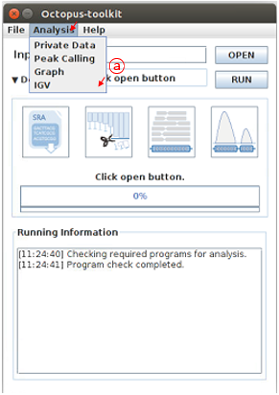

* ``A`` : Click the IGV in the Analysis menu bar.

The results of the already analyzed data are stored in the Result folder. In the Result folder, select the folder that contains the data to be analyzed. (GSE48685,GSE31578)

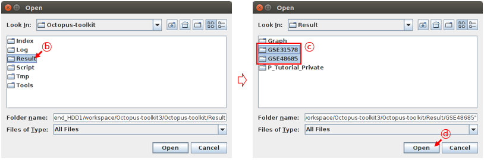

* ``B`` : Select the Result folder.
* ``C`` : Select the GSE48685, GSE31578 folder.
* ``D`` : Click the Open button.

The user selects 3 samples given 6-6.Graph and add them to the table.

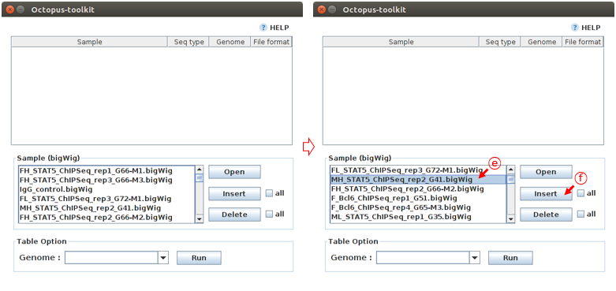

* ``E`` : Select 3 samples.
* ``F`` : Click the Insult button.

Click the Run button to start the Graph analysis. 

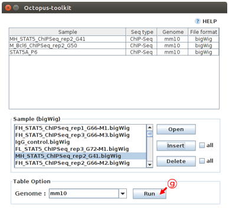

* ``G`` : Click the Run button.

Depending on the amount of data to be loaded, it may take a time to establish the IGV environment.

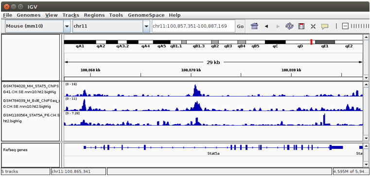

