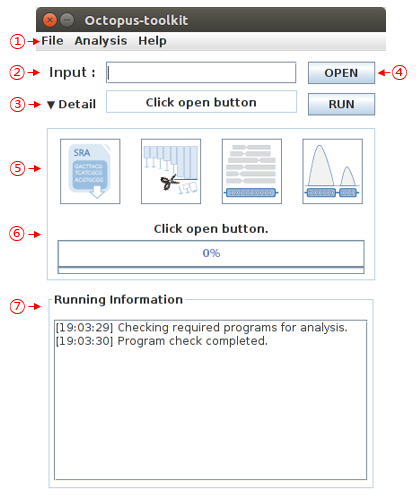
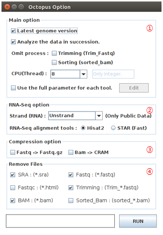
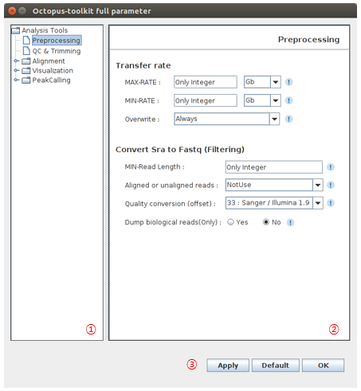
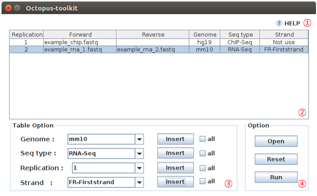
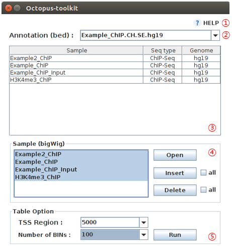
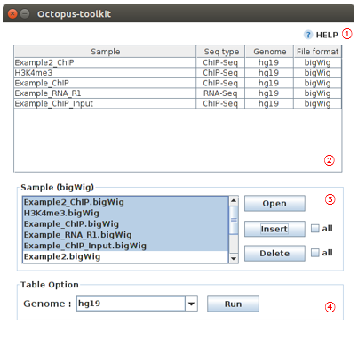

================
4.User Interface
================

4-1.Main UI
^^^^^^^^^^^

* The image below is the main UI of Octopus-toolkit

* The description of each part as follows.

.. csv-table::
   :header: "No","Name","Description"
   :widths: 1,10,44

   1,``Menu Bar``,Functions such as Private analysis (your data).
   2,``Input``,Input GEO accession number (GSE or GSM) or a text file containing GEO accession numbers (one GSE or GSM per line).
   3,``Status``,brief information regarding steps and errors.
   4,``Open and Run``,Run the anlaysis.
   5,``Full parameters``,Setting up the parameters for each tool.
   6,``Progress bar``,Progress bar.
   7,``Running information``,Status window

4-2.Menu Bar
^^^^^^^^^^^^

* Details below.

.. csv-table::
   :header: "Menu","Sub Menu","Description"
   :widths: 10, 10,35

   File,``Exit``, Exit the Octopus-toolkit
   Analysis,``Private Data``,Analyze your data
   ,``Peak Calling``,Find peaks (enriched regions) for ChIP-seq MNase-seq MeDIP-seq and ATAC-seq with HOMER.
   ,``Graph``,Draw the Heatmap and Line Plot from the output.
   ,``IGV``,Visualization using IGV (`Integrative Genomics Viewer <http://software.broadinstitute.org/software/igv/home>`_)
   Help,``Manual(Tutorial)``,Go to the Octopus-toolkit manual page.
   ,``Error Code``,Go to the Octopus-toolkit :ref:`Error code<error>` page.
   ,``Homepage``, Go to the Octopus-toolkit homepage
    
4-3.Octopus Option
^^^^^^^^^^^^^^^^^^

* Octopus-toolkit options

.. csv-table::
   :header: "No","Name","Description"
   :widths: 1,8,37

   1,``Main option``,Main options.
   2,``RNA-Seq option``,Options for RNA-seq data only.
   3,``Compression option``,To save disk space.
   4,``Remove Files``,Delete selected intermediate files after each process.

4-4.Full parameters
^^^^^^^^^^^^^^^^^^^

* The following image shows Full parameters window.

.. csv-table::
   :header: "No","Name","Description"
   :widths: 1,8,37

   1,``Analysis tree``,Select one of steps
   2,``Paremeter window``,Change parameters for the process you selected
   3,``Apply``,You can apply or reset the option.

4-5.Private Table
^^^^^^^^^^^^^^^^^

You can analyze your own data (Fastq) using Octopus-toolkit (Analysis - Private Data). The private Table is a setup window for your data.

To analyze your own data, you must select appropriate information as follows.

.. list-table::
   :widths: 1 8 37
   :header-rows: 1

   * - No
     - Name
     - Description
   * - 1
     - ``Help``
     - Go to the tutorial page.
   * - 2
     - ``Private table``
     - Files with related information.
   * - 3
     - ``Setup``
     - The option window is used to set appropriate information needed for processing given files.
   * - 4
     - ``Apply``
     - You can apply or reset the option.

4-6.Peak Calling Table
^^^^^^^^^^^^^^^^^^^^^^

You can identify peaks using the Peak Calling function. You have to select appropriate options for each file from the setting window.

RNA-seq data will not be applied.

.. image:: _static/Interface/5.Peak_calling.png

.. csv-table::
   :header: "No","Name","Description"
   :widths: 10, 10,35

   1,``Help``,Go to the tutorial.
   2,``Set up table``,Parameters for peak calling
   3,``Files``,Select files for analysis
   4,``Setup``,Select appropriate options for given files
   5,``Apply``,You can apply or reset the parameters

4-7.Graph Table
^^^^^^^^^^^^^^^

To draw heatmap and line plots with the identified regions.

RNA-seq data will not be applied.

.. csv-table::
   :header: "No","Name","Description"
   :widths: 10, 10,35

   1,``Help``,Go to the tutorial.
   2,``Annotation``,Choose a peak file.
   3,``Samples``,Status window
   4,``Sample bigWig files``,Select bigWig files of samples you want to draw over the identified regions in the peak file.
   5,``Option``,Defin the range (bp) relate to the center of peaks.

4-8.IGV Table
^^^^^^^^^^^^^

You can visualize your data with bigWig files via IGV (IGV, `Integrative Genomics Viewer <http://software.broadinstitute.org/software/igv/home>`_).

.. csv-table::
   :header: "No","Name","Description"
   :widths: 10, 10,35

   1,``Help``,Go to the tutorial.
   2,``Samples``,Status window.
   3,``Sample bigWig files``,Select bigWig files for visualization.
   4,``Genome``,Choose the reference genome.

