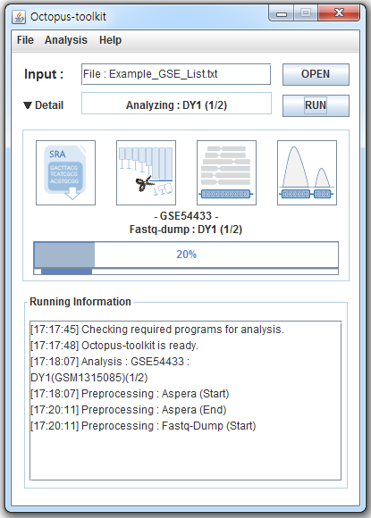

=============================================
10.Octopus-toolkit for Windows(alpha version)
=============================================

10-1.Development Environment 
----------------------------

* Window version : 7
* Eclipse : Neon.1a Service Release(4.6.1)
* Language : Java Programming language (JDK1.8)
* Graphic User Interface(GUI) : Swing & Windowbuilder

10-2. Requirement
-----------------

To run the Octopus-toolkit, Java 8 (JDK, Java Development ToolKit) or higher must be installed on your computer.

10-3.Alpha test version 
-----------------------

Octopus-toolkit Alpha version : (:download:`Octopus-toolkit_win_test_version.exe<_templates/Octopus-toolkit_win_test_version.exe>`)

* Running window. (Test)

