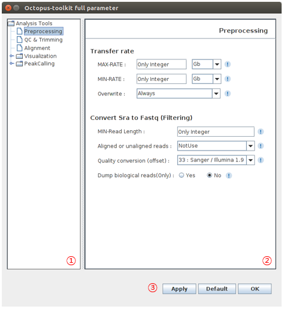

==============
User Interface
==============

Main UI
^^^^^^^

The image is the main screen of Octopus-toolkit

.. image:: _static/Interface/1.main.png

* The explanation of the each part is as follows.

.. csv-table::
   :header: "No","Name","Description"
   :widths: 1,10,44

   1,``Menu Bar``,Mune bar provides the user with the necessary functions and methods for analysis.
   2,``Input text area``,The input test area allows you to enter the published GEO accession number you want to analyze.
   3,``Summary note``,The summary note displays brief information about tha analysis process and errors.
   4,``Open and Run``,Open and Run can load the GEO accession number list and start analysis using Run buttion.
   5,``Full parameter``,The full parameter can be set for parameters to be used in each analysis process.
   6,``Detail note``,Detail note can be checked on the analysis process status through the progress bar.
   7,``Running log``,The running log displays the time record and analysis status for the entire analysis process.

Menu Bar
^^^^^^^^

* The functions of the menu bar in Octopus-toolkit are described below.

.. csv-table::
   :header: "Menu","Sub Menu","Description"
   :widths: 10, 10,35

   File,``Exit``, Close Octopus-toolkit
   Analysis,``Private Data``,NGS analysis using private data.
   ,``Peak Calling``,Find the region of peak mapped on the genome.
   ,``Graph``,Draw the Heatmap and Line Plot.
   ,``IGV``,Visualization using IGV (`Integrative Genomics Viewer <http://software.broadinstitute.org/software/igv/home>`_)
   Help,``Manual(Tutorial)``,Go to the Octopus-toolkit manual site.
   ,``Error Code``,Go to the Octopus-toolkit :ref:`Error code<error>` site.
   ,``About Octopus-toolkit``, Information about Octopus-toolkit
    

Octopus Option
^^^^^^^^^^^^^^

The image is the option of Octopus-toolkit. 

.. image:: _static/Interface/2.Octopus_Option.png

.. csv-table::
   :header: "No","Name","Description"
   :widths: 1,8,37

   1,``Main option``,A window where you can set basic options for analysis.
   2,``Remove Files``,Delete selected files after each process analysis for HDD free space.

Full parameter
^^^^^^^^^^^^^^

* The following image shows Full parameter window.

.. csv-table::
   :header: "No","Name","Description"
   :widths: 1,8,37

   1,``Analysis tree``,The Window shows the analysis process and you can select the desired process
   2,``Paremeter window``,This window allows you to set the Full parameter of the process you selected
   3,``Button``,You can apply or initialize the option using each button.

Private Table
^^^^^^^^^^^^^
If you have raw data(Fastq), the private Table is a setup window for analyzing your data.

When private data used, only you knows the information of the sample, so you must select the sample information.

.. image:: _static/Interface/4.Private_analysis.png

.. list-table::
   :widths: 1 8 37
   :header-rows: 1

   * - No
     - Name
     - Description
   * - 1
     - ``Help``
     - Go to the tutorial. (How to use the private table)
   * - 2
     - ``Private table``
     - The table can confirm the information of the set private data.
   * - 3
     - ``Information window``
     - The option window is used to set the information of the private data that is loaded.
   * - 4
     - ``Button``
     - You can use each button to load new private data, initialize the configured table information, and start analyzing the data.

Peak Calling Table
^^^^^^^^^^^^^^^^^^

Peak Calling table is a setting window for detecting the region of the mapped read to the genome after analyzing the public and private data.

Peak Calling excludes RNA-Seq among the NGS-Seqs that can be analyzed in Octopus-toolkit.

.. image:: _static/Interface/5.Peak_calling.png

.. csv-table::
   :header: "No","Name","Description"
   :widths: 10, 10,35

   1,``Help``,Go to the tutorial. (How to use the peak calling table)
   2,``Peak calling table``,The table can confirm the information for the set data for peak calling.
   3,``Sample selection window``,This window allows you to select the sample to analyze the region of the mapped read and control data
   4,``Information window``,This option window allows you to select the control data and type associated with the selected sample.
   5,``Button``,Each button can be used to initialize the information of the set sample and start data analysis.

Graph Table
^^^^^^^^^^^

Graph table is a setting window for drawing heat map and line plot of samples based on detected region.

Graph function excludes RNA-Seq among the NGS-Seqs that can be analyzed in Octopus-toolkit.

.. image:: _static/Interface/6.Graph.png

.. csv-table::
   :header: "No","Name","Description"
   :widths: 10, 10,35

   1,``Help``,Go to the tutorial. (How to use the graph table)
   2,``Annotation``,Select the peak region that will be the base to draw the heat map and line.
   3,``Graph table``,The table can confirm the information for the set data for graph function.
   4,``Sample selection window``,This window allows you to select the sample to draw the graph.
   5,``Option``,This window allows you to select the TSS region and the number of BINs.

IGV Table
^^^^^^^^^

IGV table is a setting window for visualizing the selected sample through the visualization tool. (IGV, `Integrative Genomics Viewer <http://software.broadinstitute.org/software/igv/home>`_).

.. image:: _static/Interface/7.IGV.png

.. csv-table::
   :header: "No","Name","Description"
   :widths: 10, 10,35

   1,``Help``,Go to the tutorial. (How to use the igv table)
   2,``IGV table``,The table can confirm the information for the set data for visualizing samples.
   3,``Sample selection window``,This window allows you to select the sample for visualizing samples.
   4,``Option``,This window allows you to select the genome information.

